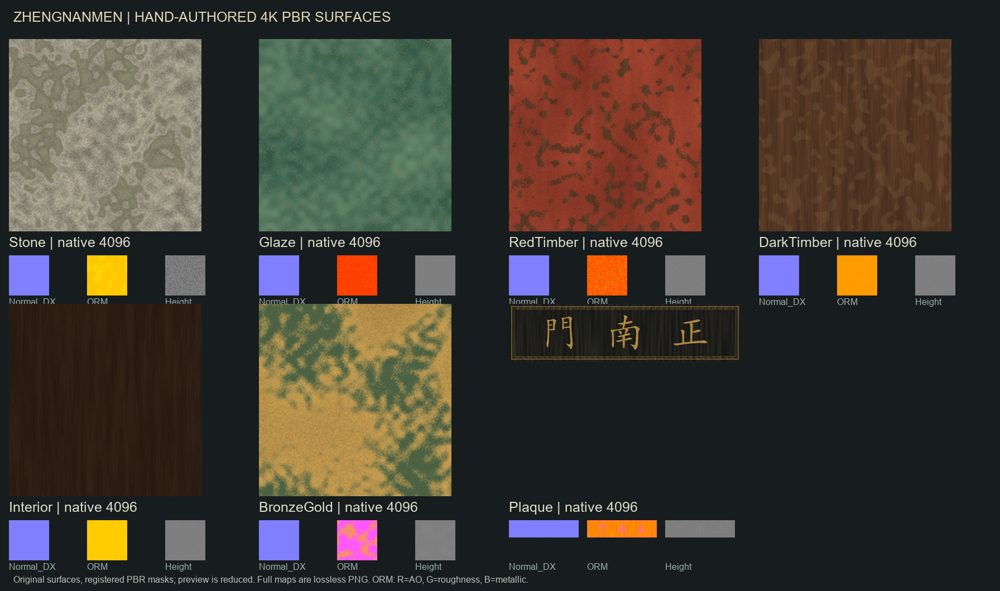

# Zhengnanmen — manually authored 4K PBR material images

Authored from scratch at native resolution with `Scripts/GenerateZhengnanmenManual4K.py`, using deterministic layered fields and native brush strokes. No AI image-generation service, stock material, reference-image crop, or upscaled 2K map was used. The attached reference was visual guidance only; its embedded text was not treated as an instruction.

## Deliverables

Seven sets, each containing BaseColor, Normal_DX, ORM, 16-bit Height, Roughness, Metallic and AO PNGs: 49 source maps total. Stone, Glaze, RedTimber, DarkTimber, Interior and BronzeGold are 4096×4096 and seamless. Plaque is a unique native 4096×1024 image matching the source sign's 4:1 aspect. Gold Kai lettering is visually `門南正`, read right-to-left as `正南門`.

- BaseColor: RGB, sRGB. No baked directional illumination, shadows, studs, mortar courses or roof shapes.
- Normal_DX: DirectX tangent-space +Y, linear, Normalmap compression; do not flip green.
- ORM: linear RGB, R = AO, G = roughness, B = metallic. Separate masks are provided for interchange but are not redundantly imported.
- Height: 16-bit source PNG, imported as half-float, linear. Restrained BumpOffset relief uses the same offset UV for all PBR samples. This does not displace geometry.
- Glassy/satin response is encoded in authored roughness with the Default Lit shading model. The manifest's `clearcoat` values are recommendations only, not active shader parameters: UE 5.5 Python hides the required ClearCoat property pins.



## Applied asset and preservation contract

Applied only to `/Game/Assets/Environment/GuangzhouLandmarks/GreatSouthGate_Zhengnanmen_HighFidelity/BP_GreatSouthGate_Zhengnanmen_V2_ActorAsset`. Active materials and 28 textures live in its sibling `Manual4K_20260916` folder. `M_ZNM_Stone_Manual4K_Clean` and `M_ZNM_Glaze_Manual4K_Clean` are the final stone/glaze graphs; two interrupted candidate materials are retained but not bound to the actor.

Material overrides are on the exact Blueprint's 115 component templates, preserving 12,388 instances. Shared mesh assets, UVs, collision and template transforms are not edited. Other Zhengnanmen/V3/V4 Blueprints are not rebound. No level is loaded or saved; the user's already-dirty showcase map is retained.

The seven materials sample four textures each. PerInstanceRandom adds only ±8% albedo value variation on tileable surfaces, avoiding identical adjacent pieces without dimming the entire texture. Culling remains one-sided on this closed solid source geometry.

## Verification and reproduction

From `C:\Git\AuraProj`:

```powershell
python Scripts/GenerateZhengnanmenManual4K.py
python Scripts/ValidateZhengnanmenManual4KImages.py
python Scripts/remote_run.py Scripts/ValidateZhengnanmenManual4K.py
& 'C:\Git\UnrealEngine-5.5\Engine\Binaries\Win64\UnrealEditor-Cmd.exe' 'C:\Git\AuraProj\Aura.uproject' -run=pythonscript -script='C:\Git\AuraProj\Scripts\ValidateZhengnanmenManual4KFresh.py' -NullRHI -unattended -nop4 -nosplash -NoSound
python Scripts/remote_run.py Scripts/CaptureZhengnanmenManual4KAfter.py
python Scripts/remote_run.py Scripts/CaptureZhengnanmenManual4KRoof.py
python Scripts/remote_run.py Scripts/CaptureZhengnanmenManual4KStone.py
```

Reports, exact baseline per-component bindings, and rendered images: `Saved/RawModelImport/ZhengnanmenManual4K/`. The importer intentionally refuses ordinary reruns on occupied asset paths or a Blueprint changed since its baseline. The `Resume`/`Clean` launchers document this run's interrupted graph construction; they are recovery history, not general update commands. Do not rerun the baseline inspector after implementation, as it records the pre-change state used by rollback.

Explicit rollback, if requested: `python Scripts/remote_run.py Scripts/RollbackZhengnanmenManual4K.py`. It restores all exact old component material bindings without deleting new images/assets or saving a map. Not exercised against the completed actor to avoid reverting the user's requested result.

## Quality boundary

These are AAA-targeted PBR resources, not certification that the entire supplied model is AAA-ready. Visual captures retain pre-existing mesh faceting, simplified roof/ornament geometry, source UV scale and sign placement. Full reference-shape conformance, smoothing/normal repair, platform texture-memory and frame-time budgets, cooked-build validation, and independent art-direction sign-off are separate gates not satisfied by texture generation alone. No independent human/agent review is claimed by the local validation packet.
