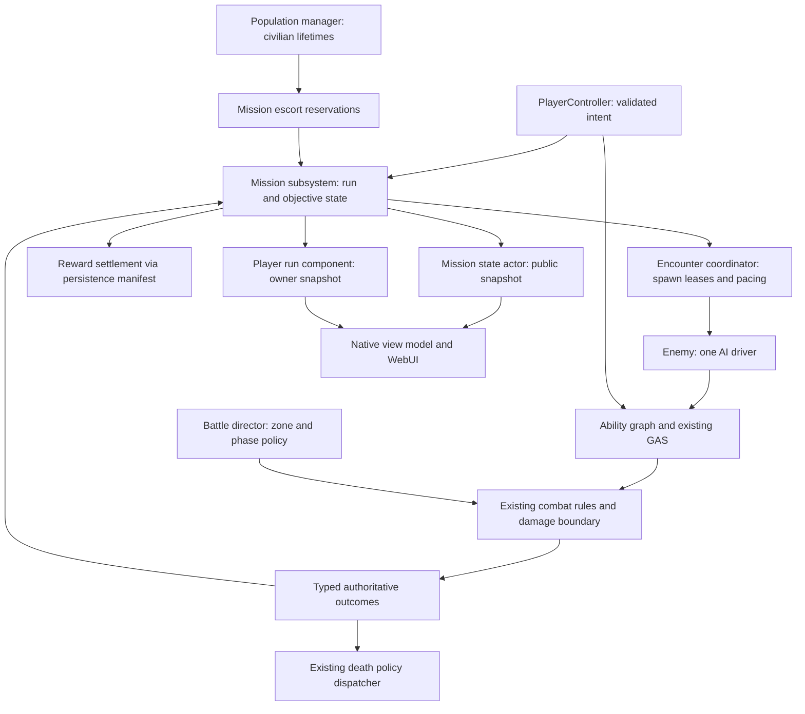

# Gameplay expansion architecture contract

Date: 2026-08-31. Status: proposed implementation design; all new types/files below are planned outputs, not existing APIs. The [roadmap](Gameplay-Expansion-Implementation-Plan-2026-08-31.md) owns scope. Later implementation must preserve the contracts below or record a scope revision.

## Ownership and dependency direction

`UAuraMissionSubsystem` is a world-lifetime coordinator that mutates state only on authority. It is created/initialized by the existing GameMode readiness flow after content, population and battle rules are valid. A replicated `AAuraMissionState` actor publishes compact public state; world subsystems themselves are not assumed to replicate. GameMode remains boot/login/death routing, not the container for every mission function.

`UAuraEncounterCoordinator` is an authority-only UObject owned by the mission subsystem. `UAuraRunLoadoutComponent` belongs to PlayerState; `UAuraRunRecoveryComponent` is the mission recovery adapter. A planned `UAuraGameplayDefinitionRegistry` loads immutable validated definitions once per world generation. These are small separate owners inside the Aura module, not new plugins or generic event-bus infrastructure.

## Exact extension map

Paths use repository-relative notation in documents. New public headers have matching private `.cpp` implementation paths unless they contain only structs/enums.

| Existing owner to retain | Planned addition / change | Contract |
| --- | --- | --- |
| `Source/Aura/Private/Game/AuraGameModeBase.cpp` | Initialize `Public/Gameplay/AuraMissionSubsystem.h`; route mission death/recovery and profile-specific rewards | Bootstrap and dispatch only; legacy profile remains default without an explicit server gameplay profile. |
| `Public/Battle/AuraBattleDirector.h`, `Public/Combat/AuraCombatRules.h` | Add run policy context without a second damage decision | Mission phase requests map to existing allowed battle transitions. Safe zones, life state and friendly-fire policy remain mandatory. |
| `Public/World/AuraPopulationManager.h` | `Public/Gameplay/AuraEscortObjectiveComponent.h` | Reserve existing designated civilians; never spawn hostiles through the Civilian-only manager. |
| `Public/Character/AuraEnemy.h`, `Public/AI/AuraBehaviorUAgentComponent.h` | `Public/Gameplay/AuraEnemyArchetypeComponent.h`, `AuraEncounterCoordinator.h` | One AI driver, one spawn lease, one accepted death per generation; controlled cancellation. |
| `Plugins/AuraAbilityGraph/Source/AuraAbilityGraph/Public/DataAbility.h`, `AbilityGraphTypes.h` | Narrow interfaces for evade, attack timeline, and status application | Plugin requests validated gameplay actions; it does not depend on concrete Aura mission classes. |
| `Public/Player/AuraPlayerState.h` | `Public/Gameplay/AuraRunLoadoutComponent.h`, `AuraRunRecoveryComponent.h` | Persistent ASC retained; run state and tracked granted handles are removed on every terminal path. |
| `Public/Game/AuraPersistenceSubsystem.h`, `AuraSaveTypes.h`, `AuraPlayerSaveGame.h`, `AuraWorldSaveGame.h`, `AuraPersistenceManifestSaveGame.h` | Versioned run-entry marker and settlement receipts | Reuse record/manifest checksum and commit mechanism; no parallel save database. |
| `Public/Player/AuraPlayerController.h` | Whitelisted run/choice/ping/interact intents | Ownership, RunId, epoch, revision, target, distance, LOS, Alive/action eligibility revalidated server-side. |
| `Public/UI/WidgetController/OverlayWidgetController.h`, `Private/UI/HUD/AuraHUD.cpp` | `Public/UI/WidgetController/MissionWidgetController.h` plus existing WebUI panels | Replicated state is truth; native code constructs the view model. No raw profile IDs in public JSON. |
| `Scripts/ValidatePlayableCandidateContent.ps1`, `RunPlayableCandidate.ps1` | New gameplay adapter and gameplay manifest validators | Reuse launch/evidence conventions without changing the meaning or scope hash of Days 21–40. |

The new gameplay profile is `GameplayExpansionV1`; the previous `PlayableCandidateV1` behavior is preserved under the old scope. The authoritative server selects the profile at launch. A client cannot choose rules through a URL/RPC. Both profiles still resolve `/Game/Maps/StartupMap` through level ID `RoleBattleCivilianTest`; profile names are not new map IDs. Mission anchors and overlays are enabled only in the gameplay profile.

## Run lifecycle and command contract

`Hub → Preparing → Active → Extraction → Settling → Completed → Hub`; `Preparing → Hub` on cancellation, `Active/Extraction → Settling → Failed` on wipe/timeout. `Aborted` is used for server shutdown/crash recovery or invalid content/actor failure, never as a successful completion. Exactly one terminal result per `(RunId, Epoch)`.

- `RunId` is a server-generated GUID, `Epoch` increments when the world session resets, `Revision` is monotonic within the run. Every delayed callback captures all three relevant lifetime identifiers plus an encounter/objective generation. A stale callback does nothing and emits a typed reason.
- Public snapshot: profile/content hash, run/mission/arrangement IDs, phase, revision, server phase deadline, objective counters, member public role/life state, and allowed tactical cues. Private owner snapshot: augment offers, chosen augments, supplies, own eligible reward summary. Profile keys, future spawn plan and other players' wallet/inventory are never public.
- Reliable owner RPC carries `RunId`, epoch, `RequestId`, expected revision, command enum and allowlisted definition/target ID. It never carries reward amount, success, arbitrary asset path, damage or movement destination. Per-owner request cache: last 128 receipts, 120-second TTL; duplicate requests return the committed result. Requests older than that remain harmless through current state/revision checks and durable settlement receipts.
- Gameplay command limit 10 requests/second with burst 20; pings 2/second with burst 3. Core ability input retains existing limits. UI can display a pending action for two seconds then an explicit timeout with safe retry of the same RequestId; it cannot fake success.
- Server monotonic time drives combat, objective and run timers. UTC remains solely for the old merchant restock/persistence timestamps. Deterministic random **decisions** are reproducible from seed, stream counter, content hash, and recorded server outcome inputs; physics/network simulation is not claimed bitwise deterministic.
- Preparation starts only after every connected participant is ready; role is frozen at run entry. The second player can decline. All later clients wait in hub/spectator and are excluded from this run's rewards. Reconnect is the same authenticated participant, not an additional entrant.

Day 42 supplies an interim mission death policy before Day 51 adds rescue: intercept accepted gameplay-profile deaths before legacy respawn scheduling, mark the member incapacitated, retain dead state across reconnect, let surviving members continue, and fail once no live member/proxy remains. Do not enable infinite legacy respawn during the early combat slice. Hub restoration happens only after terminal cleanup.

## State lifetime and persistence

| State | During run | Pawn replacement / same-server reconnect | Server restart |
| --- | --- | --- | --- |
| Wallet, permanent inventory, role, tutorial | Preserve committed hub profile; run cannot trade or mutate this inventory | Existing identity and checkpoint restore | Existing committed profile restores |
| Health/mana/ammo/ability level for gameplay balance | Server normalizes to versioned role loadout; BungeeMan starts 12/48, Aura firearm is NotApplicable | Run component reattaches current completed values; never refills via reconnect | Run abandoned, hub snapshot restored |
| Run supplies, augments, objective progress | Transient authority state | Retained for existing member for 60 seconds; pending choice retains the same offers/deadline | Discarded; no resume from mid-combat |
| Rescue charges and death/recovery | Run-owned, exactly-once consumption | Reconnect retains spent charge and current life state | Existing hub recovery normalization |
| Mission settlement / mastery badges | Durable only at terminal commit | Receipt lookup returns same result | Receipt and reward restore together or neither does |

Day 42 must implement the isolation foundation **before** any augment/refill/reward feature: require capacity for the maximum 100-gold payout in every participant's wallet, then commit a run-entry record containing the hub snapshot and a persistent `ActiveRunId` marker; only then grant the normalized loadout. Capacity 99 rejects entry in the hub; capacity 100 succeeds. During a run, existing logout/checkpoint paths serialize the hub snapshot plus marker, never the temporary attributes/ammo/abilities. Prevent merchant access, spell-point/level purchases, and legacy enemy XP/loot rewards in the gameplay profile. Exclude all run-granted specs/effects from generic ability capture. On restart, a marker without a terminal receipt means `AbortedServerRestart`: restore hub state and clear it in a new manifest generation; do not overwrite the old checkpoint. If the entry commit fails, remain in hub.

No long-running run resumes across server restart in this milestone. Same-server disconnect retains an authority-owned targetable dormant pawn/proxy and profile lease for 60 seconds. Cancel inputs, interactions and reload; retain health, resources, absolute cooldown deadlines and committed attack/DoT membership. Existing enemies, impacts, effects and the run deadline continue; there is no disconnect immunity. Reconnect attaches that same retained state, including death. Count a live proxy for wipe/current-encounter membership. If no connected Alive participant remains, suspend only new enemy admissions while a live proxy's lease remains; existing combat can still kill it and cause a normal wipe. Listen host exit terminates the run; no host migration.

Day 42 must hook `AAuraPlayerController::PawnLeavingGame` and GameMode logout/profile release so engine teardown cannot destroy the retained authority avatar/state first. Run-owned UObject references retain the profile snapshot, player state/ASC as needed and proxy lifetime independently of the disconnected controller. Replacement possession in `AuraCharacter.cpp::PossessedBy/LoadProgress` attaches run state before any legacy profile/default application, save, recovery normalization or `MarkCombatReady`; only verified pawn/ASC attachment publishes Alive. Failures remain Dead/Recovering with no replicated default-resource window. Legacy profile flow is unchanged.

At lease expiry or explicit member abandonment, transactionally restore that member's hub snapshot and clear its ActiveRunId before releasing the profile; retain a run-owned Forfeited tombstone. Expiry/abandonment awards that member zero, without erasing survivors' progress. An unsuccessful expiry commit keeps the profile locked and ineligible for hub edits/new runs until repair; do not release it first. Remove the proxy without kill credit and recompute wipe after commit. With no remaining participants, abort after final grace expiry unless a normal wipe has already terminated the run. Final settlement cleans up every still-bound marker, including zero-action/ineligible/dead members, but credits only eligible members; compare the expected RunId and profile generation. It must not write an expired member's subsequent hub generation.

Day 42 introduces a batch prepare/commit extension to the existing manifest writer for all participants' run-entry snapshots. Day 53 reuses it for **one terminal settlement generation for every still-bound participant, with credits only for eligible members**, including disconnected reserved profile records. Acquire profile locks in sorted stable-key order, prepare every new profile and world receipt, write records, then switch the manifest. If any preparation/write fails, restore all in-memory prepared state and leave the prior manifest authoritative. Publish wallet/badge/UI revisions only after commit. Do not simulate cross-player atomicity using a loop of independent `SavePlayerAndWorldCheckpoint` calls. Settling blocks a new run and retries at 1/2/4 seconds; after three failures expose `SettlementBlocked` and require storage repair/retry under the same RunId, not a newly generated reward key.

Settlement key: `(WorldPersistenceId, RunId, ProfileKey, RewardVersion)`, stored server-side. Formula per eligible participant: 50 gold for accepted primary objective, 25 for successful boss/extraction, 25 for completed optional cache; cap 100. Ordinary wipe/20-minute timeout settles only already completed objectives/cache; technical run abort awards zero and voluntary member abandonment forfeits only that member. Eligibility requires readiness at run start, at least 60 seconds of connected participation and at least one server-observed combat/support/objective action; a participant disconnected at settlement is eligible only within its still-bound 60-second lease. No last-hit reward, no civilian-kill payment, no multiplicative team-size payout. Three cosmetic badges correspond to first successful completion of each template; no new permanent combat stat progression.

Day 53 reserves a versioned `GameplayGuidanceMask` in the durable merge allowlist, separate from legacy tutorial bits. Day 56 accumulates accepted guidance actions in run memory and merges the mask on normal terminal cleanup, member forfeit/expiry and graceful shutdown; forced crash restores the last committed mask. Gold, badges and this mask are the only intentional changes over the hub snapshot. Reset is an explicit hub-only transaction. Migration/checksum and reconnect/terminal tests cover the field; no guidance can mark itself complete from a client claim.

## Combat and build contracts

Damage, debuffs, pickups, environmental attacks and boss attacks reuse `UAuraCombatRules` and the existing authoritative damage/effect path. A cue's visuals cannot apply damage. Day 52 hazard actors register an authority-owned non-player combat identity with Enemy faction, valid Alive source state and RunId/activation attribution, using the existing combat identity/rules interface and a minimal source ASC whose authoritative avatar is the hazard actor. Apply damage through the existing damage GameplayEffect path; no player controller or profile attribution is created. Neutral is not an invented faction. Hazards award no player XP/loot/kill credit; safe zones, life-state gates, friendly-fire policy and protected-civilian rules still apply. Invalid/missing hazard source identity rejects damage. `AttackId`, server start time, impact deadline, shape and cancel reason are replicated for telegraph presentation. Heavy attacks have server windup >=0.85 seconds. For observers relevant before Windup starts, the 150ms RTT/2% loss fixture must show >=0.65 seconds of rendered cue lead on at least 95% of 100 attacks; report every delayed cue and the denominator, and fail readability if the threshold is missed. Late-relevance observers see only remaining time and form a separately reported cohort; do not count them as full-lead successes. A deliberately delayed-delivery test reports degraded lead and never substitutes server timestamps for rendered evidence.

Shared evade: 350-unit maximum displacement, 0.25-second swept movement, 2.5-second cooldown, one charge, no invulnerability in this slice. Validate owner/life/cooldown/direction first; only an accepted request cancels the owner's interaction/channel/reload and commits cooldown, then attempts swept movement. A fully blocked sweep still consumes that accepted cooldown and leaves the channel cancelled. Invalid/duplicate requests cancel nothing. Client sends direction input, never a final world location; recovering members cannot evade. Do not add custom movement prediction until reconciliation failures are measured; cue/animation may be predicted, position remains validated.

`Exposed` is a one-stack, three-second server effect produced by Electrocute after 0.5 seconds of valid contact or by Shock Trap once per target per activation. FireBolt or Focus Shot consumes it for 25% extra direct damage; ordinary FireGun and area ticks do not consume it. Focus Shot costs two existing rounds, has a 0.4-second windup and a four-second cooldown. Shock Trap has a 10-second cooldown, lasts six seconds, radius 250, slows by 30% for two seconds and exposes at most three hostiles. No ammunition is charged if spawn/validation fails; consume at the authoritative accepted execution boundary. Budget these as explicit extensions to the existing firearm interface, not a bypass of the single-round FireGun contract. Both roles can set up and consume Exposed themselves.

Three status rules only: Exposed (above), Slow (strongest wins, never below 60% base movement), Interrupt (one event; Disruptor channel interrupted, then two-second interrupt immunity). No new general-purpose status engine. Effects/handles tracked by RunId are removed on run exit, avatar replacement and cancellation as appropriate; never remove unrelated persistent effects by a broad tag wipe.

Exposed is one server record per target: owner participant ID, RunId, activation ID, monotonic application sequence and expiry. Every accepted reapplication has a new server sequence. Replace ownership only if proposed expiry is later than current expiry, or if equal use the lower server sequence; never shorten expiry. The selected application determines support credit and steady_hands duration. Atomic consumption removes the selected record once. Test augmented/unaugmented simultaneous applications, refresh, expiry and competing consumers with controlled server ordering.

The Interrupt trigger is also explicit: Shock Trap's first valid hit and an accepted ArcaneShards direct impact interrupt an interruptible channel. Existing generic hit-react is not silently treated as Interrupt. Add the server outcome/interface in Day 45, then bind these player actions on Day 46; Disruptor-only test fixtures may inject that accepted interface during Day 45.

Day 46 introduces the minimal run-owned supply interface needed by Day 47: two medkits restoring 35% health, and a reachable emergency terminal in each combat cell (three-second interruptible channel, 30-second per-member cooldown, six reserve rounds or 20% mana). Day 52 extends that same owner with one resource pack per participant (24 reserve rounds or 50% mana), second-cell station and optional risk. Day 54 requires an emergency terminal reachable inside the boss arena with its finale gates closed. All charges, cooldowns and claim receipts survive same-server reconnect but are discarded on run end. Persistent inventory is never the supply source.

| Augment ID | Eligibility and effect | Cap / concrete assertion |
| --- | --- | --- |
| `quick_step` | Shared: evade cooldown 2.0s instead of 2.5s | No second charge; never repeated in offers after chosen |
| `guarded_step` | Shared: after evade finishes, 20% incoming damage reduction for 1s | No invulnerability; no refresh stacking |
| `steady_hands` | Shared: expose duration becomes 4s for the owner's applied effects | Does not extend another player's existing effect |
| `field_medic` | Shared: run medkit restores 45% instead of 35% max health | Never over max health or adds charges |
| `forked_spark` | Aura: Electrocute may select one extra target | Total additional-target cap remains five; costs unchanged |
| `ember_ring` | Aura: FireBlast radius +20% | Target/damage rules unchanged; no second hit per projectile |
| `fast_cycle` | BungeeMan: completed reload takes 1.0s instead of 1.25s | Existing lost-input/reload cancellation and ammo invariants preserved |
| `wide_trap` | BungeeMan: trap radius 325 instead of 250 | Still at most three hostiles |

Offers are three distinct eligible definitions, sampled without replacement from a server seed stream; two selections per run at cell boundaries. After choice one, remove it from later pools. At a 20-second choice deadline choose the first listed still-valid offer and display the auto-choice. Offer IDs/revisions are private; clients cannot reroll by reopening UI/reconnecting. A data validation failure before entry blocks the run; a mid-run invalid offer aborts rather than silently substituting an undocumented effect.

## Encounters, objectives and space

Enemy spawn lease key `(RunId, EncounterId, SlotId, Generation)` is distinct from civilian member identity. Successful spawn reserves and commits the slot; failure releases it. Maximum 16 live mission hostiles for two players, 10 solo; boss counts as one. Spawn attempts require authority, validated class, reachable navmesh, valid capsule fit, at least 1000 units from either active player and no direct view from either; test three candidate anchors at one-second intervals, then abort the encounter with `SpawnUnavailable`. Never over-spawn to compensate for pending leases. Ordinary death increments objective counters once; technical destroy/lifetime expiry releases the slot without awarding a kill and causes a bounded replacement or typed failure.

Use existing regular UE Behavior Tree tasks for mission AI. Explicitly disable/unregister the BehaviorU test driver for mission-managed enemies **before either starts**; keep BehaviorU and legacy BT behavior intact for their own fixtures. A class that cannot provide a valid configured combat tree fails spawn readiness. A designer can select archetype data, not simultaneously enable multiple movement/attack authorities.

Objective types are `Clear`, `Escort`, `InteractHold`; reducer inputs come from accepted death, reserved civilian arrival, or server-validated channel completion. IDs and revision are explicit; a scene actor's `Destroy` or a client counter cannot complete an objective. Assault clears a finite second-cell lease roster; Rescue Relay reserves two civilians and delivers both; Sabotage disables two relays with 3-second uninterrupted channels. Channels require 200-unit range, LOS and alive state; damage, evade, disconnection or target revision change cancels progress. Counter/deadline bounds live in definitions. Only one player owns a relay channel at a time.

Day 43 first implements a simple ordered pair of finite Clear cells (three enemies each), current-cell identity and exactly-once CellCompleted notifications in the mission owner. Day 47 consumes both boundary events. Day 48 generalizes the sequence into validated objective data; it does not create the first missing boundary after augments already depend on it.

Day 45's Disruptor field grants 20% incoming-damage reduction to at most two allies within 600 units while its two-second channel is active. Remove the effect on channel end/cancel/death/range loss; maximum effect expiry is the channel deadline. Overlapping fields do not stack: the lowest live source lease ID owns one effect handle, with reevaluation when that source ends. Day 45 also adds heavy-attack admission tokens to EncounterCoordinator: acquire at Windup for every live player/proxy within 600 units of the committed attack shape, max two tokens per affected participant; release after impact/cancel/death, not later than Recovery exit. A multi-target attack consumes one token for each affected participant; reject/requeue if any budget is full. Aim and damage shape freeze at Windup, including Lancer's full one-second cue. Admission coverage is a snapshot at that instant; players may subsequently move into or out of the already telegraphed shape, which does not retarget or guarantee a cap on voluntarily entered hazards. Generation-bound cleanup releases tokens. Day 50's scheduler reuses this owner.

Mission space remains a runtime overlay on StartupMap. Day 41 records actual world-space anchors/navmesh and safe-zone overlaps; no coordinates are invented by this plan. Day 43 writes verified transforms and geometry references into `GameplayArenaLayouts.json`. Day 49 adds the second arrangement using the same schema. Each arrangement needs two combat cells, alternate cover route, relay pads, escort start/shelter, boss area and hub exclusion bounds. Reachability, capsule fit, visibility and the safe-zone policy are engine-tested. Ordinary civilians remain protected; only reserved mission escort actors may take enemy damage under the gameplay profile. Player damage to civilians is always denied. No dynamic reputation law or permanent civilian loss.

## Performance and failure discipline

Start with event-driven counters, immutable definition caches, timer-driven pacing at 2Hz, nearby target searches staggered at 5Hz, and snapshot updates only on changes (HUD progress at most 10Hz). Never reduce the authoritative impact clock or collision validation to the pacing frequency. Bound cues/effect actors, pending leases and outcome receipt memory. Measure actor lifecycle before considering pooling; pool introduction requires proving reset of ASC effects, role identity, delegates, timers and lease generation.

Day 58 budgets on the Day 41 recorded reference hardware: 30Hz dedicated simulation, game-thread p95 <=25ms and p99 <=33.3ms; 1080p Medium client frame p95 <=22ms and p99 <=33.3ms; new gameplay scheduling <=2ms p95 on server; per-client outbound p95 <=100KiB/s and <=25% above matched actor-count pre-optimization baseline. Five-minute warmup then ten-minute samples; three runs per matched fixture. Mission actor/timer/effect counts return exactly to baseline at hub, and process memory growth stays <=5% after ten cycles. Record hardware, resolution, build and trace settings. These are acceptance targets, not measurements of the present build. If the reference hardware cannot meet them, revise hardware/content scope before sign-off, not after inspecting a failing run.

Fail closed on content mismatch, unknown role/target, stale run generation, partial settlement, impossible nav placement or invalid life state. Fail visibly on cancellation/timeout; bounded retries never count as successful outcomes. See the shared execution contract for process timeouts, result codes and artifact binding.
