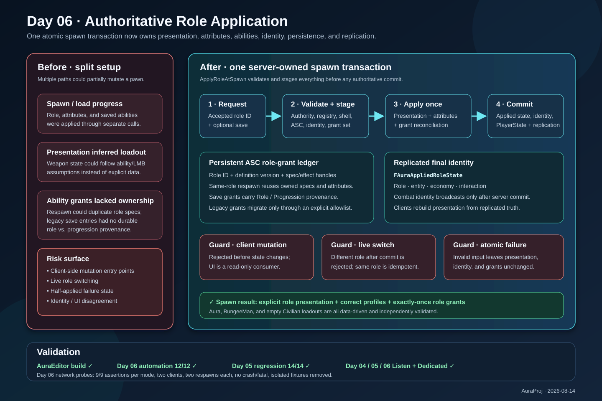

# Day 06 authoritative role application

## Intent

Complete the Day 06 role-application plan with one server-authoritative spawn transaction that produces a stable replicated role identity, applies presentation and attributes deterministically, and gives each persistent ability-system component exactly one owned set of role grants.

## Changed behavior

- `ApplyRoleAtSpawn` now validates authority, the role registry, pawn shell compatibility, the ASC, combat identity, and the complete grant set before committing authoritative state.
- `FAuraAppliedRoleState` is the replicated final role snapshot. Clients consume that snapshot for presentation and cannot mutate the role transaction, ability grants, attributes, or combat identity.
- Presentation is cleared and rebuilt from explicit role data. Equipment is no longer inferred from the LMB ability, so the Civilian role can remain an empty loadout.
- A persistent ASC ledger owns role-created ability specs and removable effects across pawn respawns. Same-role reapplication is idempotent; a different live role is rejected.
- Saved abilities now carry role/progression provenance and a provenance version. Known shipped legacy grants use an explicit migration table; removed or mismatched role grants are not silently promoted into progression grants.
- Role application returns structured errors and preserves the previous applied snapshot when validation or commit fails.
- The non-shipping Day 06 probe and runner cover Aura and BungeeMan on two clients, client mutation rejection, isolated save reconciliation, and two respawns in Listen and Dedicated modes.

## Validation

- `AuraEditor Win64 Development`: passed; final build reported target up to date.
- `Aura.RoleBattle.Day6`: 12/12 tests passed, 0 failure markers.
- `Aura.RoleBattle.Day5`: 14/14 regression tests passed.
- Day 06 network smoke: Listen and Dedicated passed; all 9 assertions passed per mode, both clients completed two respawns, no probe/crash/fatal markers were found, and isolated fixtures were removed.
- Day 05 config smoke: Listen and Dedicated passed; the role config and reload sentinel were restored.
- Day 04 damage smoke: Listen and Dedicated passed.
- `git diff --check`: passed (line-ending notices only).

The installed Epic Unreal Engine distribution does not expose an `AuraServer` build target. Dedicated runtime behavior was therefore validated with `UnrealEditor-Cmd -server`, matching the existing project smoke-test workflow.

## Illustration

[Open the archived SVG](2026-08-14-day-06-authoritative-role-application.svg)
