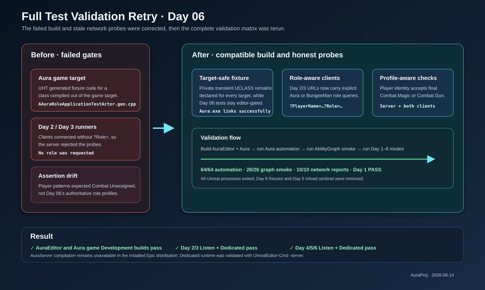

# Full test validation retry

## Intent

Retry the complete project build and test matrix after the first Day 06 validation exposed a game-target UHT failure and stale Day 2/3 network probes.

## Corrective changes

- The private transient `AAuraRoleApplicationTestActor` fixture is now declared consistently for all C++ targets, so UnrealHeaderTool-generated code has a matching class in the Aura game target. Day 06 automation references remain editor-gated.
- Day 2 and Day 3 clients now connect with explicit `?PlayerName=... ?Role=Aura/BungeeMan` query data required by the role-login contract.
- Day 2 identity assertions now recognize the authoritative role combat profiles (`Combat.Magic` and `Combat.Gun`) rather than requiring the pre-role `Combat.Unassigned` profile.

## Validation

- `AuraEditor Win64 Development`: passed.
- `Aura Win64 Development`: passed and linked `Aura.exe`.
- `Aura.RoleBattle` and all `Aura`-prefixed automation: 64/64 passed, 0 failed.
- AuraAbilityGraph engine smoke: 26/26 passed; FireBolt Python structural test passed.
- Day 1 smoke: passed, including BungeeMan wiring and two respawn vital checks.
- Day 2, Day 3, Day 4, Day 5, and Day 6 network smokes: Listen and Dedicated passed (10/10 reports). Day 6 completed both roles, two clients, two respawns, and all assertions.
- No Unreal processes remained; Day 6 isolated fixtures were removed; Day 5 config reload sentinel was removed; PowerShell parsing and `git diff --check` passed.

The installed Epic Launcher engine cannot compile `AuraServer` targets. Dedicated behavior was still exercised through `UnrealEditor-Cmd -server`, as in the project’s existing fallback smoke workflow.

## Illustration

[Open the archived SVG](2026-08-14-full-test-validation-retry.svg)
