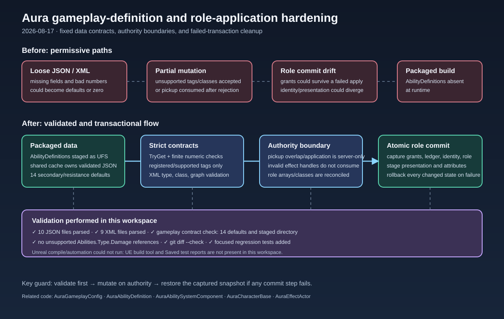

# Role and gameplay validation hardening

## Intent

Fix the reviewed gaps in the finished GAS, pickup, data-definition, and Role/Battle plans without allowing invalid config or partial authoritative role state to publish.

## Changed behavior

- `AbilityDefinitions` is staged with packaged UFS content, and all current XML fixtures use registered ability-type tags.
- Shared attribute defaults are parsed once through the cached config service with required fields, finite-number checks, and supported-tag validation. Unsafe direct JSON getters were removed from the affected attribute paths.
- XML definitions now reject missing/unregistered tags, unsupported types, malformed numeric values, invalid effect classes, incomplete curve pairs, and missing graphs.
- Role arrays reject empty entries; class and XML grants validate stable ability tags, input-slot uniqueness, passive/offensive contracts, and LMB compatibility.
- Pickup overlap/application and removal paths are authority-only, and a rejected effect handle no longer destroys the pickup.
- Role application captures and restores the ASC grant ledger/specs/definition roots, combat identity, PlayerState role, and presentation on a failed commit. Attribute specs are validated and populated before mutation where the role path can fail.

## Validation

- All 10 `Content/Config/*.json` files parsed successfully.
- All 9 `Content/AbilityDefinitions/*.xml` files parsed successfully.
- Gameplay contract check passed for 14 shared secondary/resistance defaults and the packaged `AbilityDefinitions` staging entry.
- No stale `Abilities.Type.Damage` references remain in source or content.
- `git diff --check` passed; only expected LF/CRLF conversion notices were reported.
- Focused regression coverage was added for strict XML parsing, shared defaults, empty role-array entries, and the updated role/type contract.
- Unreal compile and automation could not run because the UE build tool and `Saved` reports are absent from this workspace.

## Illustration

[Open the archived SVG](2026-08-17-role-gas-validation-hardening.svg)
