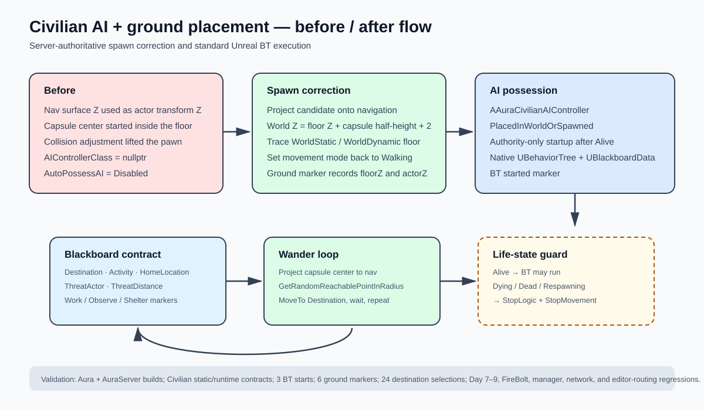

# Civilian AI and ground placement fix

## Intent

Fix the two visible Civilian failures: no Behavior Tree execution and Civilians spawning above the floor.

## Changed behavior

- `AAuraCivilian` now selects `AAuraCivilianAIController` and auto-possesses it for placed and runtime-spawned actors.
- The server builds and runs a standard Unreal `UBehaviorTree`/`UBlackboardData` wander loop with native destination and MoveTo tasks.
- BT startup is gated on the Civilian reaching the `Alive` combat state; later life-state transitions stop logic and movement.
- Population candidates and final spawned actors use the navigation surface plus scaled capsule half-height, followed by a WorldStatic/WorldDynamic floor trace.
- Runtime logs now expose controller possession, BT startup, ground correction, and repeated destination selection.

## Validation

- `Aura Win64 Development` build: passed.
- `AuraServer Win64 Development` build: passed.
- `Scripts/test_civilian_ai.py`: focused source contracts passed.
- `Scripts/test_civilian_ai.py --log Saved/Logs/Day10-civilian-game-runtime-20260820-003500.out.log`: passed; 3 BT starts, 6 ground markers, and 24 destination selections.
- Day 7-9 role/population contracts: 25 named tests and 5 topology runners present.
- FireBolt, Game Server Manager, network compatibility, editor-compatible routing, Python syntax, PowerShell syntax for project runners, and `git diff --check`: passed.

The open UnrealEditor process held the editor module DLLs, so the editor target could not be relinked during this run. Close and restart UnrealEditor after the source build so it loads the new `UnrealEditor-Aura.dll`; the fresh `Aura.exe` runtime target was used for the executable Civilian proof.

