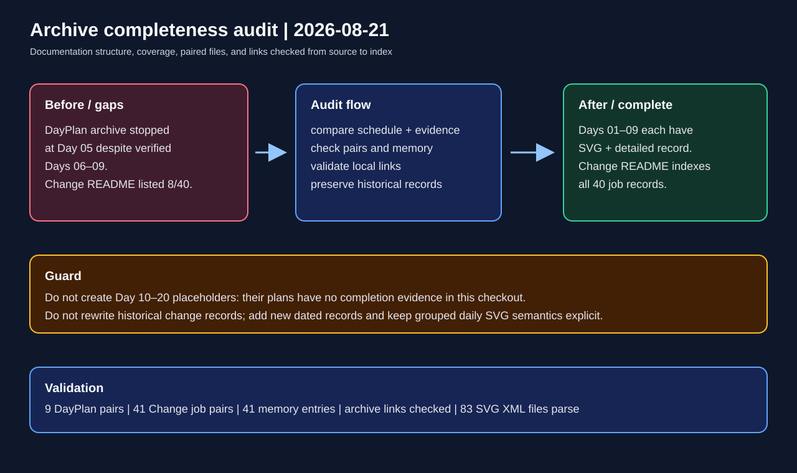

# Archive completeness audit

## Intent

Audit the documentation archive directories and finish records that were missing from the indexes and the completed DayPlan archive.

## Changed behavior

- Added paired DayPlan SVG and Markdown records for completed Days 06, 07, 08, and 09.
- Added matching overview SVGs for the two grouped daily-reference Markdown records that previously only linked to their illustration sets.
- Updated the DayPlan archive index to cover the completed schedule through Day 09 while keeping Day 10–20 intentionally absent.
- Expanded the Change Archive README from its initial eight links to an index of all job-level records.
- Aligned the Role/Battle schedule status with the retained passed packaged-topology report for the Day 07–09 slice.
- Documented that date-only daily reference SVGs are intentionally grouped and do not need one Markdown file per date.

## Validation

- Confirmed both archive directories exist and contain their README files.
- Confirmed all 41 non-README Change Archive Markdown records have matching SVGs and memory-index entries.
- Confirmed all nine completed DayPlan entries now have matching SVG and Markdown files.
- Confirmed all 83 archive SVGs parse as UTF-8 XML; the one source-code `path:line` hit is not a broken file link.
- Confirmed the working tree was clean before this documentation-only change.

## Illustration

[Open the archived SVG](2026-08-21-archive-completeness-audit.svg)
