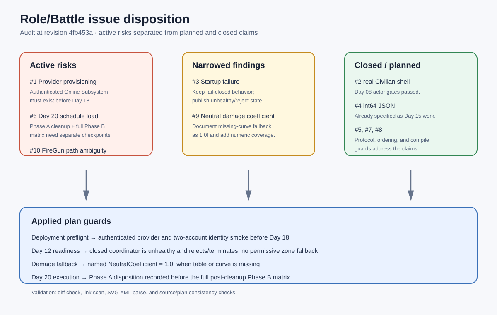

# Role/Battle issue dispositions

## Intent

Apply the audit's bottom line to the Role/Battle planning and tracking documents:
retain confirmed risks, narrow claims that were overstated, and mark closed or
scheduled items accurately.

## Changed behavior

- Added the canonical [Role/Battle issue disposition tracker](../../Tracking/Role-Battle-Issue-Dispositions.md).
- Moved authenticated Online Subsystem provisioning into a pre-Day 18 deployment preflight and explicitly blocked local/display-name identity fallback.
- Added an unhealthy/reject-or-terminate outcome for Day 12 initial startup failure while preserving fail-closed safety and last-known-good reload semantics.
- Named the missing damage-table/curve fallback as `NeutralCoefficient = 1.0f` in code and the Day 04 contract.
- Split Day 20 into explicit Phase A and Phase B review checkpoints and required an explicit zero-reference or documented compatibility decision for the legacy FireGun path.
- Corrected the stale master Role/Battle status from “Day 06 pending” to “Days 02-09 implemented and verified.”

## Validation

- `git diff --check` passed (line-ending normalization warnings only).
- Source and plan references were re-read after editing.
- Archive SVG is well-formed XML.
- The working tree was clean before this documentation/source clarification change; no Unreal build was rerun because the runtime formula remains behaviorally unchanged.

## Illustration

[Open the issue disposition SVG](2026-08-21-role-battle-issue-dispositions.svg)
