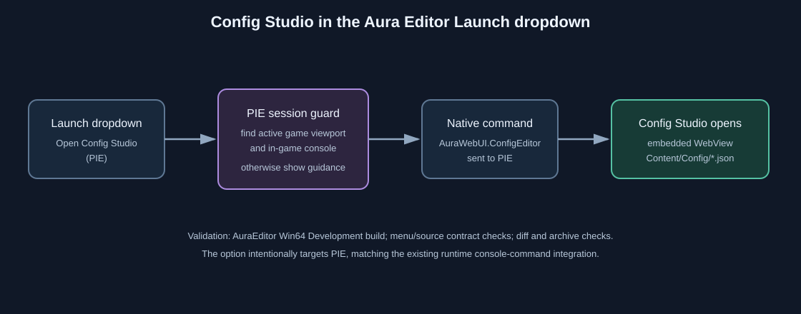

# Aura Editor Config Studio menu option

- Intent: expose the embedded configuration editor from the existing Aura Editor Launch dropdown.
- Changed behavior: `Open Config Studio (PIE)` sends `AuraWebUI.ConfigEditor` to the active Play-in-Editor console. If PIE is not running, the shared console-command guard shows a clear start-PIE message.
- Validation: AuraEditor Win64 Development build; source/menu contract checks; SVG XML and `git diff --check` validation.

