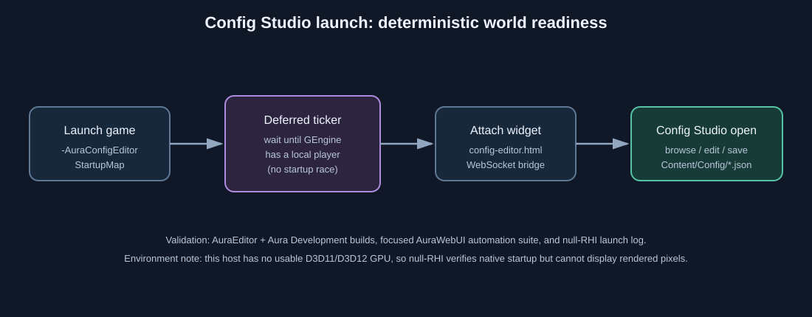

# Aura Config Studio launch

- Intent: make the configuration tool launchable from a local game command line without racing map and player initialization.
- Changed behavior: `-AuraConfigEditor` installs a short-lived ticker in the AuraWebUI module, waits for the first non-dedicated local player world, and then attaches `config-editor.html`.
- Validation: rebuilt `AuraEditor` and `Aura` Development targets; the focused AuraWebUI automation suite remained green; null-RHI launch reached the map/player-ready path and emitted the auto-open log marker.
- Environment limitation: the host exposes only Microsoft Basic Render Driver, so Unreal cannot render a visible D3D11/D3D12 game window. The null-RHI instance verifies native startup and bridge initialization but cannot provide on-screen pixels.

