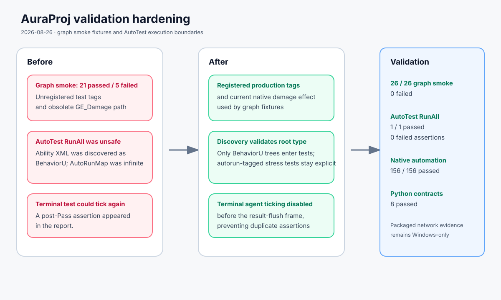

# Graph smoke and AutoTest hardening

Date: 2026-08-26

## Intent

Make the failed graph smoke cases reflect the current registered gameplay tags and native damage-effect path, and make the default AutoTest suite finite and trustworthy.

## Changed behavior

- Graph smoke fixtures now use registered production tags and the current native damage effect configuration.
- AutoTest discovery ignores non-BehaviorU XML files.
- `RunAll` and `RunByFilter("all")` exclude tests tagged `autorun`; those stress tests remain runnable explicitly.
- The AutoTest runner disables worker ticking as soon as a test becomes terminal, preventing post-Pass assertions.

## Validation

- AuraEditor Mac Development build passed.
- AuraAbilityGraph smoke: 26 passed, 0 failed.
- AutoTest RunAll: 1 passed, 0 failed, 0 timeout, 0 error; no failed assertions recorded.
- Full native Aura automation: 156 passed, 0 failed.
- Python contracts: 8 passed; packaged network checksum evidence remains unavailable on this Mac setup.

