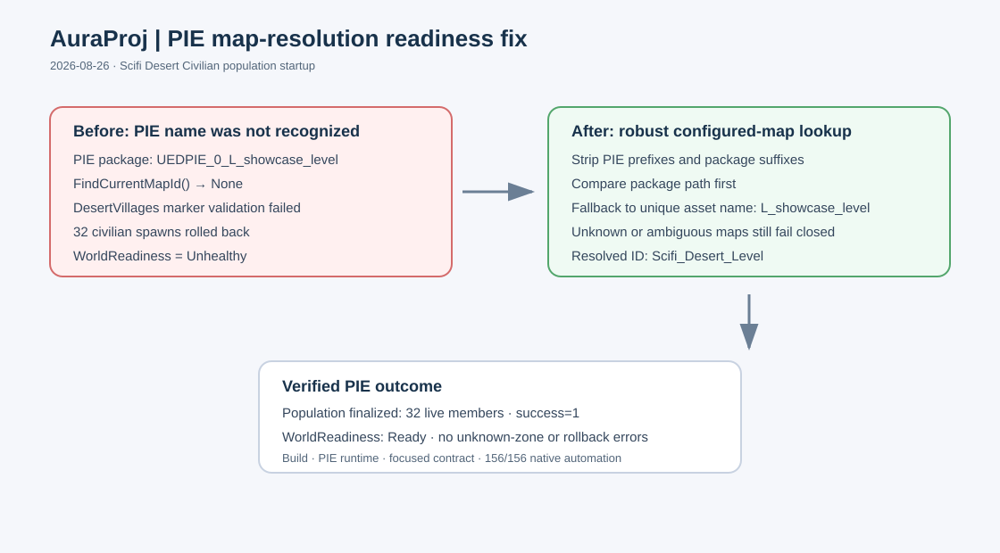

# PIE map resolution fix

## Intent

Fix the PIE startup failure where Unreal's generated `UEDPIE_0_` map package was not matched to the configured `Scifi_Desert_Level` entry. The resulting `None` map ID caused all `DesertVillages` activity markers to be rejected and rolled back the initial civilian population.

## Changed behavior

- Normalizes package/object suffixes and PIE-generated map prefixes in `UAuraPopulationManager::FindCurrentMapId()`.
- Adds a unique configured asset-name fallback for PIE map names while preserving fail-closed behavior for unknown or ambiguous maps.
- Adds a Scifi Desert regression contract for the PIE-prefix and asset-name fallback.

## Validation

- `./BuildEditor.command` passed; AuraEditor Mac Development deployed successfully.
- Fresh PIE on `L_showcase_level` reached `WorldReadiness = Ready` with 32 live civilians and no unknown-zone or rollback errors.
- Scifi Desert runtime contract passed with the captured map-runtime log.
- Full native Aura automation passed: 156/156.
- `git diff --check` passed.

