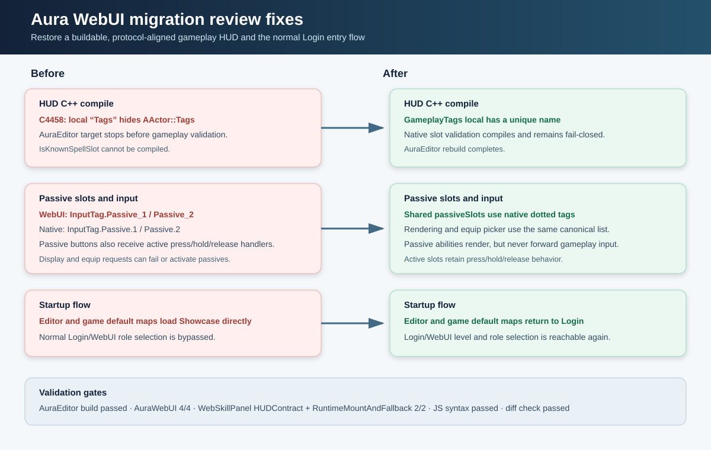

# WebUI migration review fixes

Date: 2026-08-27

## Intent

Resolve the build, protocol, and startup-flow regressions found during review of the legacy UI to WebUI gameplay HUD migration.

## Changed behavior

- Renamed the local gameplay-tag reference in `AAuraHUD::IsKnownSpellSlot` so it no longer hides Unreal’s `AActor::Tags` member.
- Made the WebUI passive slot list canonical with the native dotted tags `InputTag.Passive.1` and `InputTag.Passive.2`.
- Reused that list for passive equip selection and prevented passive abilities from receiving active press/hold/release handlers.
- Restored both editor and game default maps to `/Game/Maps/Login.Login`, keeping the Login/WebUI level and role selection flow reachable.
- Added content-contract assertions covering the passive-tag spelling, passive input guard, and startup maps.

## Validation

- AuraEditor Win64 Development build passed.
- AuraWebUI automation passed: 4/4.
- Web HUD automation passed: 2/2 (`HUDContract`, `RuntimeMountAndFallback`).
- `hud.html` JavaScript syntax check passed.
- `git diff --check` passed.

## Visual summary

