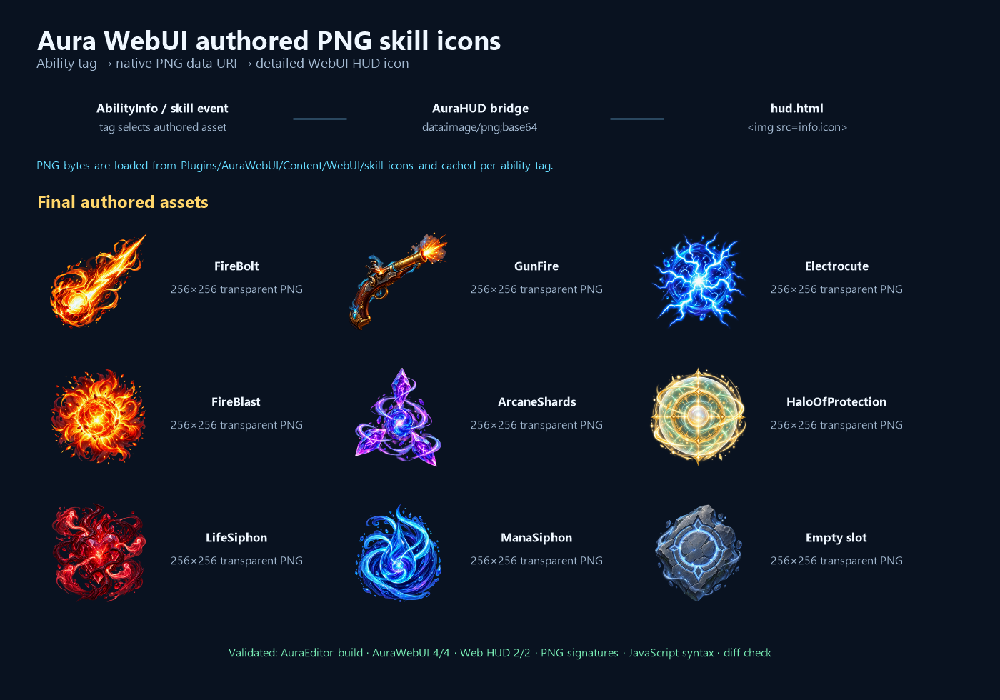

# Detailed PNG skill icons for the WebUI HUD

Date: 2026-08-27

## Intent

Replace the HUD's generic/fallback skill presentation with detailed PNG artwork for every shipped skill while preserving the existing native-authoritative bridge.

## Changed behavior

- Added nine transparent 256x256 PNG assets under `Plugins/AuraWebUI/Content/WebUI/skill-icons` for FireBolt, GunFire, Electrocute, FireBlast, ArcaneShards, HaloOfProtection, LifeSiphon, ManaSiphon, and empty slots.
- Added native ability-tag mapping and PNG-to-data-URI loading in `AAuraHUD`; the data is cached per ability tag and sent through the existing `skill_panel_ability` and `hud_spell_catalog` events.
- The WebUI HUD continues to render `info.icon` as an image, so detailed PNG artwork appears in both the skill strip and spell catalog without an HTTP asset dependency.
- Added PNG signature and per-skill asset coverage checks to the WebUI contract tests.

## Validation

- AuraEditor Win64 Development build passed.
- AuraWebUI automation passed: 4/4.
- Web HUD automation passed: 2/2 (`HUDContract`, `RuntimeMountAndFallback`).
- All nine project PNGs validated as 256x256 assets with valid PNG signatures.
- `hud.html` JavaScript syntax check and `git diff --check` passed.

## Visual summary

