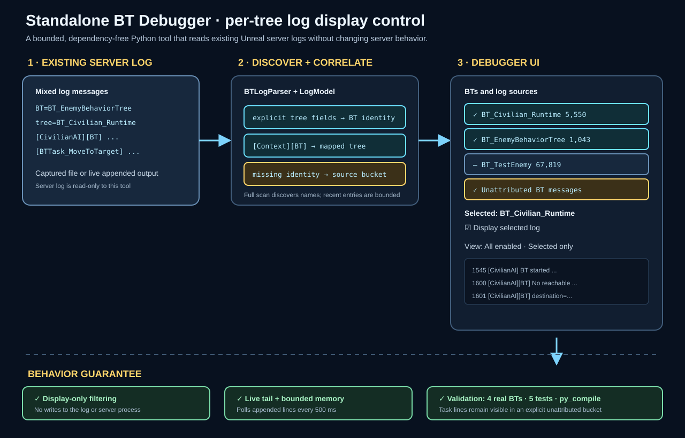

# Standalone BT debugger

Date: 2026-08-28

## Intent

Provide a small standalone tool for reducing Behavior Tree noise while debugging Unreal server logs. The first feature is a discovered BT/source list with a per-entry display switch and a selected-only view.

## Feasibility finding

The existing server logs contain mixed identity formats: native Unreal trees use fields such as `BT=BT_EnemyBehaviorTree` and `tree=BT_Civilian_Runtime`, while contextual lines use markers such as `[CivilianAI][BT]`. The current server logging category is shared and many task lines do not carry their owning tree, so changing server-side verbosity per BT would require a separate logging-schema/runtime change.

## Changed behavior

- Added [`Scripts/bt_debugger.py`](../../../Scripts/bt_debugger.py), a standard-library-only Tkinter program.
- It opens the newest `Saved/Logs/*Server*.log` by default, or a log supplied with `--log`.
- It scans the selected file, discovers BT identities, correlates contextual BT messages to the tree seen in startup lines, and follows appended lines when `Follow live` is enabled.
- The UI supports `Show` switches for each discovered BT/source, `Show all` / `Hide all`, `All enabled` / `Selected only`, and text search.
- Task/service/decorator messages without a reliable tree identity remain available under source rows and the aggregate `Unattributed BT messages` row.
- The tool only changes what is displayed; it does not edit the log, send commands to Unreal, or change server logging verbosity.

## Usage

```powershell
python Scripts/bt_debugger.py
python Scripts/bt_debugger.py --log Saved/Logs/AuraServerFinal.log
python Scripts/bt_debugger.py --no-follow
```

## Validation

- `python -m unittest Scripts/test_bt_debugger.py -v` — 5/5 passed.
- `python -m py_compile Scripts/bt_debugger.py Scripts/test_bt_debugger.py` — passed.
- `python Scripts/bt_debugger.py --help` — passed.
- Real `Saved/Logs/AuraServerFinal.log` scan discovered 4 BTs: `BT_Civilian_Runtime`, `BT_EnemyBehaviorTree`, `BT_EnemyBehaviorTree_Elementalist`, and `BT_TestEnemy`.
- Real-log model check confirmed that hiding `BT_Civilian_Runtime` removes its correlated entries from the enabled view while unrelated entries remain.

## Follow-up details to replenish later

For true server-side suppression, each BT log event needs a stable tree identifier (or a dedicated log category) at emission time. A later version can then add a runtime control channel and/or per-agent filtering without relying on context correlation.

## Visual summary


