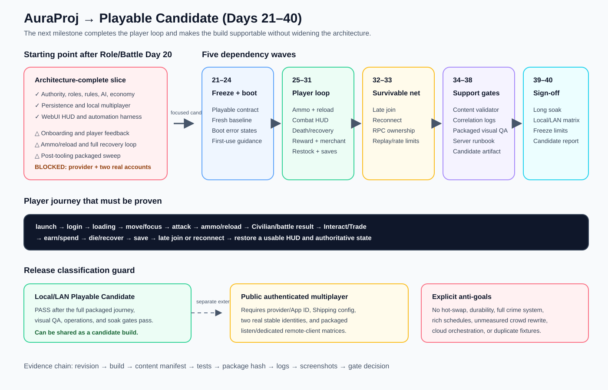

# Playable Candidate roadmap — 2026-08-29

## Intent

Record the next twenty logical development days after the Role/Battle first vertical slice, using the local project review and the independent in-app ChatGPT architecture review.

## Changed planning behavior

- The project now has a discoverable, dependency-ordered Days 21–40 plan focused on a playable local/LAN candidate rather than another broad architecture arc.
- The plan makes boot, onboarding, minimum authoritative ammo/reload, combat feedback, player death/recovery, reward-to-merchant flow, persistence, late join/reconnect, packaged visual QA, server operations, diagnostics, content validation, candidate packaging, and soak testing explicit gates.
- The plan separates Fast, Candidate, and External Release gates so missing production provider/accounts block only the public release classification, not local development or candidate work.
- Historical map/AI/test-manifest drift is treated as a contract/documentation issue unless a real player or designer requirement proves the missing asset is needed.
- Role hot-swapping, durability, full reputation/crime, rich business simulation, unmeasured crowd optimization, wholesale legacy cleanup, cloud orchestration, and new test-framework expansion are explicit anti-goals.

## Validation

- Reviewed all twenty existing Role/Battle day contracts, the implementation index, day archive, UI plan, issue dispositions, GAS TODO tracker, vertical-slice report, and current source/config/tooling surfaces.
- Completed an independent in-app ChatGPT review; it could not independently inspect the repository and was given only the scoped architecture/status evidence packet.
- Confirmed the generated master plan links to twenty per-day contracts and is indexed by `Docs/README.md`.
- Confirmed the plan preserves the known external production-provider/account blocker and does not claim it as passed.
- Confirmed the SVG parses as XML and the documentation diff is whitespace-clean.

## Archived deliverable

Master plan: [Playable Candidate — Days 21–40](../../Plans/Playable-Candidate-Implementation-Plan-2026-08-29.md)  
Readiness review: [Playable Candidate readiness review](../Playable-Candidate-Readiness-Review-2026-08-29.md)
