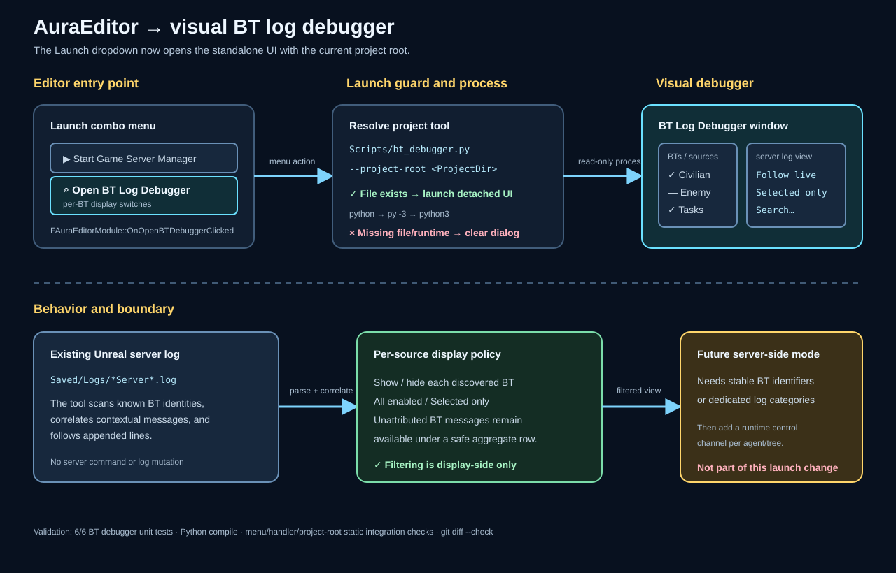

# Visual BT debugger editor launch

Date: 2026-08-29

## Intent

Make the visual BT log debugger reachable from the existing `AuraEditorModule` Launch dropdown so an editor user can open it without finding or running the tool manually.

## Changed behavior

- Added `Open BT Log Debugger` to the legacy Aura `Launch` combo menu.
- The handler resolves `Scripts/bt_debugger.py` and passes the absolute project root, allowing the tool to select and follow the project server log using its existing visual UI.
- The handler launches a detached process through the first available `python`, `py -3`, or `python3` runtime, with hidden console flags so the Tk window is the user-facing surface.
- Missing script and launch-runtime failures produce editor dialogs and log entries; the server process and its log remain untouched.

## Validation

- `python -m unittest Scripts/test_bt_debugger.py -v` — 6/6 passed.
- `python -m py_compile Scripts/bt_debugger.py Scripts/test_bt_debugger.py` — passed.
- Source-level integration checks confirmed the menu entry, handler binding, script path, `--project-root` forwarding, and Python fallback list.
- `git diff --check` — passed; existing line-ending warnings only.
- A full Unreal editor build was not run in this pass.

## Visual summary

