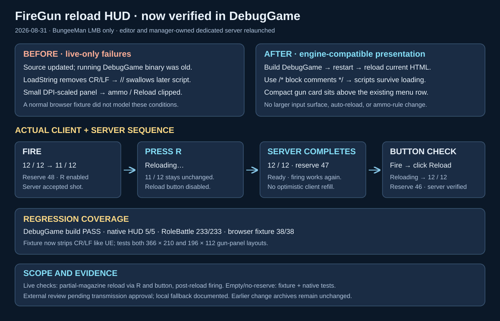

# FireGun reload HUD: DebugGame rollout and live fixes

Date: 2026-08-31

## Intent

Apply the already-implemented BungeeMan-only reload HUD to the user's running DebugGame configuration and verify it in the actual editor/client/server session. This is a follow-up to [the initial reload HUD implementation](2026-08-31-bungeeman-reload-hud.md); that earlier record is intentionally immutable.

## Findings and corrections

1. The old DebugGame DLL predated the UI changes, and Live Coding prevented rebuilding while the editor was open. With the user's explicit restart approval, the editor was closed cleanly after its status showed **All Saved**, the old server stopped, and `AuraEditor Win64 DebugGame` built successfully. Editor PID 9012 and final manager-owned server PID 14832 were running at verification time.
2. A direct server launch could listen on 7784 but lacked the manager's per-launch readiness nonce. The normal Connect flow consequently launched another server on 7785. Both transient test servers were stopped; reconnecting through the normal game menu let GameServerManager launch exactly one valid server on 7784. No readiness/authentication checks were disabled or bypassed. Use the manager-owned connection flow for future restarts.
3. Live HTML loading exposed a regression missed by the original browser fixture: UE 5.5 `CEFBrowserHandler.cpp` lines 470–471 remove CR and LF from `LoadString` content. The new `//` comments in the right-top and bottom scripts then swallowed subsequent JavaScript. Replaced those comments with `/* ... */` so both scripts initialize inside Unreal.
4. The actual DPI-scaled editor panel had approximately 196 × 112 usable CSS pixels rather than the nominal 366 × 210 test fixture. Added a compact FireGun card for panels at most 160 pixels tall. Ammo, reserve, status and the Reload button now sit above the existing menu row; the native input-capture bounds are unchanged. The existing coordinate display uses the remaining bottom line only when the gun card is applicable. No Aura ability or ammo rule was changed.
5. `Scripts/firearm_hud_fixture.mjs` now applies Unreal's CR/LF removal to the real shipped HTML before serving it, parses normal and transformed scripts, and exercises both nominal and compact layouts. This models the bug-producing transport rather than only normal file loading.

## Live verification

In the editor's actual BungeeMan client connected to the manager-owned Scifi Desert server:

- Gun HUD showed `12 / 12`, reserve 48, and a disabled Reload button while full.
- Clicking the LMB FireGun skill fired one round; the visible HUD changed to `11 / 12`, reserve 48, with Reload enabled.
- Pressing R while the skill panel had focus displayed **Reloading…** and disabled the reload control. On server completion, HUD became `12 / 12`, reserve 47.
- Clicking FireGun again after reload produced another accepted shot, `11 / 12`, reserve 47.
- Clicking the visible compact **Reload [R]** button displayed **Reloading…**; server completion restored `12 / 12`, reserve 46. Client and server remain running for the user.

Server evidence in `Saved/Logs/GameServerManager/Scifi_Desert_Level.log` (UTC Aug 30; local Aug 31):

| UTC | Evidence |
| --- | --- |
| 17:34:53.915 | Accepted FireGun; magazine 11, reserve 48, revision 2 |
| 17:35:25.929 | Reload request accepted; ReloadStarted |
| 17:35:27.216 | Reload completed; loaded 1, magazine 12, reserve 47, revision 3 |
| 17:36:15.996 | Post-reload shot accepted; magazine 11, reserve 47, revision 4 |
| 17:36:50.360 | Reload-button request accepted; ReloadStarted |
| 17:36:51.637 | Reload completed; loaded 1, magazine 12, reserve 46, revision 5 |

Pre-restart logs and build output were preserved under `Saved/Automation/FireGunReloadDebugGame-20260831-0121/`. Current client `Saved/Logs/Aura.log` confirms the updated right-top/bottom HTML was loaded. Existing non-gun HUD layout limitations were not expanded into an unrelated redesign.

## Validation

- `Build.bat AuraEditor Win64 DebugGame C:\Git\AuraProj\Aura.uproject -waitmutex`: success (existing UE deprecation warnings only).
- DebugGame headless `Automation RunTests Aura.UI.;Quit`: **5/5**, including the production FirearmPresentation payload and HUD mount contracts. Repeated after final HTML edits; `Saved/Logs/FireGunReloadHUD-DebugGame-UI-Final.log`.
- DebugGame headless `Automation RunTests Aura.RoleBattle.;Quit`: **233/233**, exit 0; `Saved/Logs/FireGunReloadHUD-DebugGame-RoleBattle.log`.
- `node Scripts/firearm_hud_fixture.mjs --check`: normal and UE-transformed inline scripts parse.
- Browser fixture (`node Scripts/firearm_hud_fixture.mjs`, local port 8766, **Run regression tests**): **38/38**. Includes 12-shot exhaustion, manual reload requests, no client-fabricated completion, out-of-ammo, scope isolation, reconnect and four compact states with non-overlapping ammo/button geometry.
- `test_playable_candidate.py`: 20 checks; `test_role_battle_days_20.py`: 15 checks; `test_role_battle_review_fixes.py`: passed.
- SVG parsed/rendered and visually inspected; `git diff --check` passed.

Live verification covered partial-magazine reload and post-reload firing, not exhaustive depletion of all reserve rounds or visual tracer/decal revalidation. Empty/no-reserve UI and repeated-fire exhaustion are covered by native/browser tests, not claimed as a new live soak test.

## Independent review

The `in-app-chatgpt-handoff` skill was applied as the completion workflow. Action-time approval was requested for the limited HTML/test/results packet to chatgpt.com; no response authorized transmission in this run. The skill's privacy fallback is therefore local source inspection, native tests, engine-transformed browser tests, and live client/server verification. No private packet was sent and no external review is claimed.
