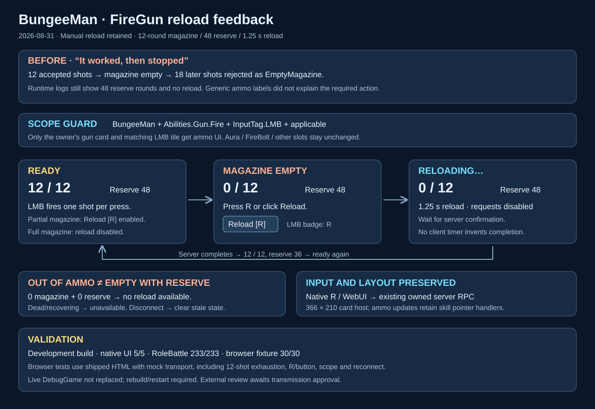

# BungeeMan FireGun manual-reload HUD

Date: 2026-08-31

## Intent and observed failure

The later firing failures were ammo exhaustion, not a newly missing flight/decal effect. `Saved/Logs/GameServerManager/Scifi_Desert_Level.log` records a 12-round magazine exhausted followed by 18 `EmptyMagazine` rejections (16:53:17–16:53:44 UTC on Aug 30). The inspected session had 48 reserve rounds and no reload events. The user requested correct reload UI for BungeeMan's gun skill only. This change does not auto-reload or alter ammo/weapon effects.

## Changed behavior and surfaces

- `AAuraHUD::BuildFirearmStatePayload`: pure, tested projection of the owner's replicated ledger. Explicit role/ability/input scope, `canReload`, out-of-ammo and unavailable states; life/role changes refresh availability even without ammo changes.
- `hud-right-top.html`: gun-only magazine/reserve card, player-facing R guidance, guarded reload control, static configured duration, explicit reloading/empty/out-of-ammo/recovering states. Fits existing 366 × 210 host without extending its input surface.
- `hud-bottom.html`: gun-only LMB ammo/reload badge. Changes existing nodes in place, preserving skill pointer-release handlers. No other skill acquires ammo presentation.
- R inside right-top/bottom browser panels uses existing `hud_reload`; repeat, modifiers, editable controls and right-top menus are excluded. Native R and server validation remain authoritative. Disconnect clears stale state; ready/reconnect replays it.
- Reload UI never refills counts or completes a reload locally. A replicated completion/cancellation/life state drives the display; no fake countdown/progress estimate.
- `Scripts/firearm_hud_fixture.mjs`: reproducible local-only actual-HTML browser fixture; substitutes transport, not rendering logic. `AuraWebHUDStateTests.cpp`: tests the production payload helper.
- Contract details: [ammo contract](../../Reference/Playable-Candidate-Ammo-Contract.md).

## Validation and evidence

- `Build.bat AuraEditor Win64 Development C:\Git\AuraProj\Aura.uproject -waitmutex`: success. Existing UE deprecation warnings remain.
- Headless `Automation RunTests Aura.UI.;Quit`: **5/5 success**, including `Aura.UI.WebHUD.FirearmPresentation`. Evidence: `Saved/Logs/FireGunReloadHUD-UI.log`, test-complete exit 0. Existing headless editor menu-registration messages are not test failures.
- Headless `Automation RunTests Aura.RoleBattle.;Quit`: **233/233 success**, exit 0. Evidence: `Saved/Logs/FireGunReloadHUD-RoleBattle.log`.
- `node Scripts/firearm_hud_fixture.mjs --check`: production HUD and fixture scripts parse.
- Serve fixture with `node Scripts/firearm_hud_fixture.mjs`, open `http://127.0.0.1:8766`, click **Run regression tests**: **30/30 passed** in in-app browser. Covers 12-shot exhaustion, node identity, reload button/R requests, repeat/modifier/menu guards, no optimistic refill or timeout completion, server completion counts, empty vs no-reserve, dead/recovering, Aura/FireBolt/role/input mismatch, disconnect/reconnect and native card bounds. Visually inspected actual empty-state card and skill row.
- `python Scripts/test_playable_candidate.py`: 20 checks passed; `test_role_battle_days_20.py`: 15 checks passed; `test_role_battle_review_fixes.py`: passed.
- SVG parse/render and `git diff --check` verified before handoff.

## Review and runtime limitations

The `in-app-chatgpt-handoff` workflow required new action-time confirmation to transmit this UI/code/test packet to chatgpt.com. Approval was requested; no packet was sent without confirmation. External review is unavailable pending that approval, so the documented privacy fallback is local code inspection, native automation, and actual-HTML browser testing. No external-review approval is claimed.

The user's active editor/server are **DebugGame**, running the previous native HUD binary. They were not terminated or overwritten. This job built **Development**; the new role/ability/input payload fields and presentation need matching rebuilt native code and reloaded HUD HTML. Close the active DebugGame editor/server, rebuild `AuraEditor Win64 DebugGame`, and restart, or start the validated Development configuration. Live multiplayer/embedded-CEF validation after restart remains unverified; the browser fixture is not that evidence.

Existing uncommitted projectile presentation changes and the previous archive were preserved. No gameplay ammo authority, reload duration, automatic reload behavior, weapon effects, or Aura abilities were changed by this UI job.
