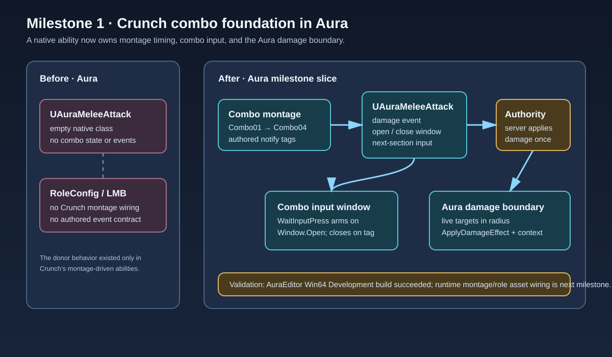

# Crunch combo foundation

## Intent

Start the character behavior migration from Crunch by giving Aura a native, montage-driven melee combo boundary that can be wired to a role in the next milestone.

## Changed behavior

- `UAuraMeleeAttack` is now an instanced ability with four configurable montage sections (`Combo01` through `Combo04`).
- Montage gameplay events open and close an input window, and a pressed input advances the montage section.
- A montage damage event queries live targets in the configured radius and routes damage through Aura's authoritative `ApplyDamageEffect` path.
- The required ability and montage event tags are registered in `Config/DefaultGameplayTags.ini`.
- The ability intentionally remains unassigned to a role until a compatible montage asset and role entry are selected.

## Validation

`Build.bat AuraEditor Win64 Development C:\Git\AuraProj\Aura.uproject -waitmutex` passed after compiling `AuraMeleeAttack.cpp` and linking `UnrealEditor-Aura.dll` (4 actions, exit code 0). Existing Unreal deprecation and license warnings remain; no new compile errors were reported.

## Scope and next step

This milestone does not import Crunch assets, alter collision channels, or grant the ability through `Content/Config/RoleConfig.json`. The next step is to select or author the montage, add its notify tags, and wire the ability into the intended Aura role before runtime testing.

