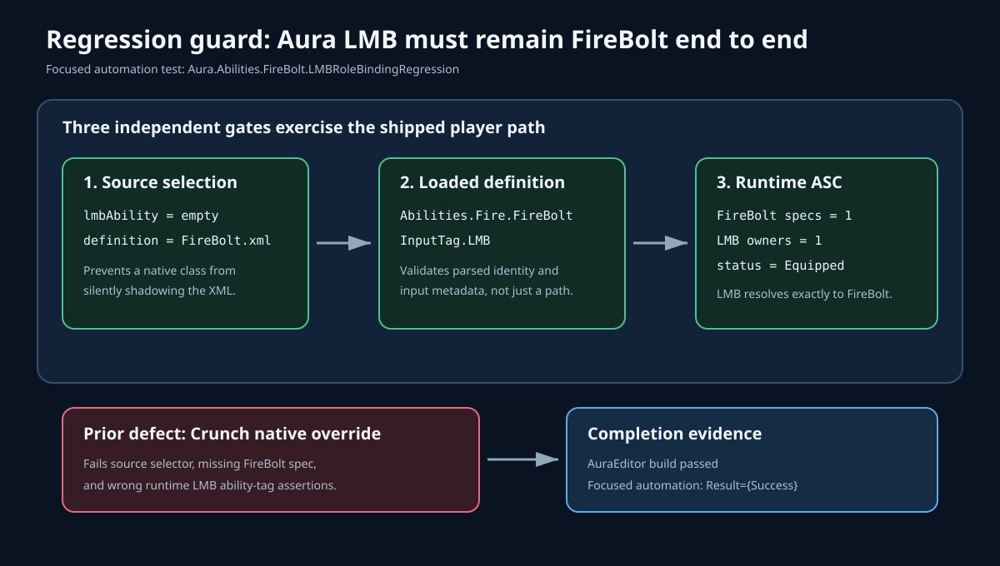

# Aura FireBolt LMB regression coverage

## Intent

Add a focused product-contract test that fails if Aura's shipped left-mouse-button ability is replaced by CrunchCombo or any other native or data-driven ability.

## Changed behavior

- Before: the broad role-definition test checked only the expected XML path. It did not exercise the post-spawn ability-system grant, slot ownership, or equipped state, so changing the expectation alongside a role migration could hide the player-facing regression.
- After: `Aura.Abilities.FireBolt.LMBRoleBindingRegression` verifies the complete binding chain: Aura has no native LMB override, the exact source is `FireBolt.xml`, the loaded definition declares `Abilities.Fire.FireBolt` and `InputTag.LMB`, and a real role-application fixture grants exactly one FireBolt spec as the sole equipped LMB owner.
- The assertions reproduce the prior failure boundary: a native Crunch override makes the source checks fail, removes the FireBolt runtime spec, and causes the runtime LMB tag assertion to resolve to the wrong ability.

## Validation

- `AuraEditor Win64 Development` built successfully with `-NoXGE -MaxParallelActions=2`.
- `Aura.Abilities.FireBolt.LMBRoleBindingRegression` completed with `Result={Success}`.
- The focused run discovered exactly one matching test and executed the actor/ASC role-application fixture under `-NullRHI`.
- `git diff --check` and SVG XML validation passed.
- Independent in-app ChatGPT review was unavailable after two bounded page-readiness attempts timed out; the review packet was never typed or sent, and no private repository data was transmitted. The successful build, focused runtime automation, SVG parse, and diff check are the documented local fallback.

## Evidence

- Automation log: `Saved/Logs/FireBoltLMBRegressionTests.log`.
- Test implementation: `Source/Aura/Private/Tests/AuraRoleBattleTests.cpp`.
