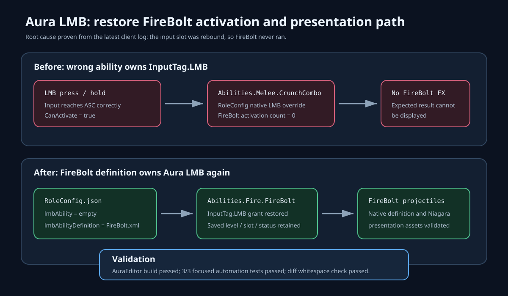

# Aura FireBolt LMB restoration

## Intent

Restore Aura's established left-mouse-button ability contract so pressing LMB activates the data-driven FireBolt ability and its projectile presentation path.

## Changed behavior

- Before: the in-progress Crunch migration replaced Aura's `lmbAbilityDefinition` with the native `AuraMeleeAttack` class. The latest client log consequently resolved every `InputTag.LMB` press to `Abilities.Melee.CrunchCombo`; FireBolt never activated, so its effect could not display.
- After: Aura again uses `/Game/AbilityDefinitions/FireBolt.xml` for LMB. The native Crunch combo implementation remains in the project but no longer replaces Aura's FireBolt role binding.
- Save reconciliation again retains an existing Aura FireBolt grant, including its level, LMB slot, and equipped status.

## Validation

- `AuraEditor Win64 Development` built successfully with `-NoXGE -MaxParallelActions=2` after an initial unconstrained attempt exhausted the machine paging file.
- `Aura.Projectiles.Definitions` passed, covering the FireBolt native projectile definition and presentation assets.
- `Aura.RoleBattle.Day6.ExistingSaveGrantReconciliation` passed, confirming saved FireBolt level, slot, and status survive role reconciliation.
- `Aura.RoleBattle.Day7.AuraDefinitionContract` passed, confirming Aura's published LMB definition is `FireBolt.xml`.
- `git diff --check` passed (line-ending conversion notices only).
- Independent in-app ChatGPT review was unavailable because no existing ChatGPT tab was present; no private repository data was transmitted. The focused build, automation, config parse, SVG parse, and diff checks form the documented local fallback.

## Evidence

- Pre-fix client log: `Saved/Logs/Aura.log` records `InputTag.LMB` resolving to `Abilities.Melee.CrunchCombo`.
- Focused post-fix automation log: `Saved/Logs/FireBoltLMBFixTests.log` records all three tests completing with `Result={Success}` and exit code 0.
