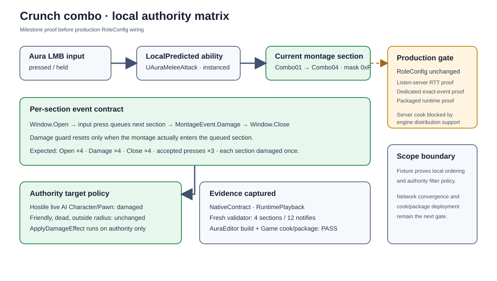

# Crunch combo authority matrix and input ordering

## Intent

Close the local behavior proof for the migrated Crunch-style Character/Pawn combo before any production RoleConfig wiring. The milestone validates prediction-key delivery, montage-event ordering, section bookkeeping, and authority-owned target filtering on Aura fixtures.

## Changed behavior

- Active ability input events now use the primary instanced ability's current activation prediction key, with the spec key retained as a compatibility fallback for non-instanced abilities.
- `UAuraMeleeAttack` keeps the montage's actual current section as the damage authority. Input queues the next section, and the next montage event advances the index and resets the once-per-section damage guard.
- The development runtime fixture records the ordered Open → input press → Damage → Close sequence for all four sections and exposes a section bitmask (`0xF`) so each section's damage event is proven exactly once.
- The authority matrix spawns Character/Pawn fixtures for hostile AI, friendly player, dead hostile, and out-of-radius hostile targets. Only the live hostile target receives authoritative damage.

## Validation

- `Aura.Migration.CrunchCombo.NativeContract` passed.
- `Aura.Migration.CrunchCombo.RuntimePlayback` passed with four open, four damage, four close events; three accepted input presses; accepted section mask `0xF`; and explicit hostile/friendly/dead/outside target assertions.
- Fresh montage validation passed: Aura skeleton, four sections, 12 server-capable gameplay notifies, strict timing, and zero embedded sequence notifies.
- AuraEditor Win64 Development build passed.
- Supported Win64 Game cook/package proof passed: `BuildCookRun` completed with `BUILD SUCCESSFUL` and exit code 0; `Aura-Windows.utoc` lists `Content/Assets/Characters/Aura/Animations/Abilities/AM_CrunchCombo_Prototype_RuntimeV2.uasset`. The dedicated-server attempt is blocked by the installed Unreal distribution reporting `Server targets are not currently supported from this engine distribution.`

## Deferred production gate

`Content/Config/RoleConfig.json` remains unchanged. Before wiring the combo into the shipped Aura role, run real listen-server prediction under approximately 100–150 ms RTT, a dedicated-server authoritative exact-event matrix, and a packaged runtime check. Those gates are outside the local isolated fixture and are not claimed here.

