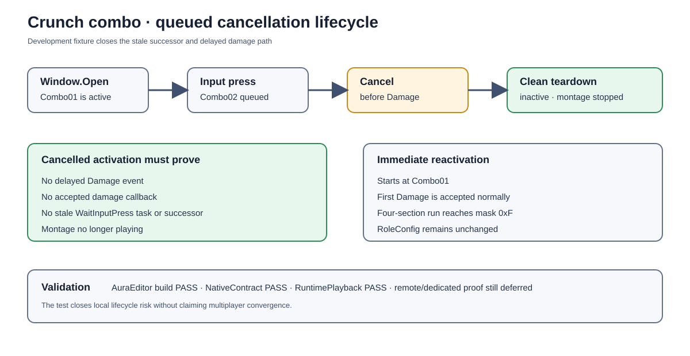

# Crunch combo queued cancellation coverage

## Intent

Close the remaining local lifecycle gap identified during the independent review: a player can press during the open window, queue a successor section, and cancel before the current section reaches Damage.

## Changed behavior

- Extended `Aura.Migration.CrunchCombo.RuntimePlayback` with a development-only queued-cancel scenario.
- The fixture now verifies that Open → press → cancel leaves the ability inactive, stops the montage, emits no delayed Damage event, and accepts no damage from the cancelled activation.
- The fixture immediately reactivates the same spec and reruns the four-section input sequence, proving Combo01 state and the per-section damage guard reset cleanly.

## Validation

- AuraEditor Win64 Development build passed after the test change.
- `Aura.Migration.CrunchCombo.NativeContract` passed.
- `Aura.Migration.CrunchCombo.RuntimePlayback` passed, including the queued-cancel assertions, four-section Open/Damage/Close counts, accepted damage section mask `0xF`, and hostile/friendly/dead/outside target matrix.
- The previous authority archive records the supported Win64 Game cook/package pass; this test-only change does not alter `RoleConfig.json` or the cooked production asset.

## Deferred production gate

The real listen-server remote-client prediction/convergence run and a dedicated-server run on a server-capable UE distribution remain required before switching the Aura LMB role from FireBolt to the combo. `Content/Config/RoleConfig.json` remains unchanged.

