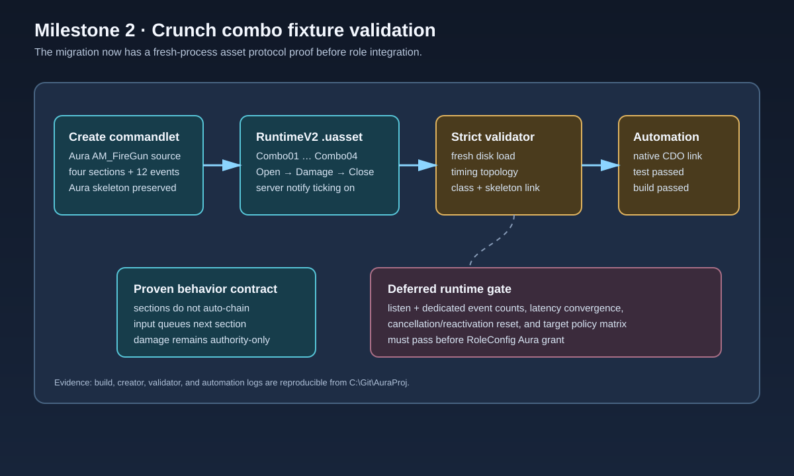

# Crunch combo fixture validation

## Intent

Turn the native Crunch combo slice into a repeatable Aura asset contract before any role grant is changed. The fixture must load from disk on a fresh editor process, use Aura's skeleton, and preserve the montage event protocol needed by the runtime ability.

## Changed behavior

- Added an editor-only `AuraCreateComboMontage` commandlet that creates `AM_CrunchCombo_Prototype_RuntimeV2` from the existing Aura `AM_FireGun` source montage, lays out four `Combo01` through `Combo04` sections, and authors Open/Damage/Close gameplay notifies.
- Dedicated-server notify ticking is explicit on all twelve events. Sections have no static successor; `UAuraMeleeAttack` queues a successor only after an input press inside the authored window.
- Added `AuraValidateComboMontage`, which fresh-loads the native class and montage, verifies the Aura skeleton, section topology, notify tags, dedicated-server flags, and strict per-section `start < open < damage < close < end` timing.
- Added `Aura.Migration.CrunchCombo.NativeContract`, an automation test that confirms the native class and generated montage remain linked.

## Validation

- `Build.bat AuraEditor Win64 Development C:\Git\AuraProj\Aura.uproject -waitmutex` passed.
- `UnrealEditor-Cmd.exe Aura.uproject -run=AuraCreateComboMontage ...` passed and saved the generated `.uasset`.
- `UnrealEditor-Cmd.exe Aura.uproject -run=AuraValidateComboMontage ...` passed with four sections, twelve notifies, and 0.233-second windows.
- `UnrealEditor-Cmd.exe Aura.uproject -ExecCmds="Automation RunTests Aura.Migration.CrunchCombo; Quit" ...` passed the native contract test.
- `git diff --check` passed with only repository line-ending warnings.

## Runtime gate and scope

The fixture is an on-disk protocol proof, not a listen/dedicated runtime proof. RoleConfig remains unchanged. The next implementation step is a development-only runtime harness covering no-input completion, timed section presses, cancellation/reactivation reset, hostile/friendly/self/dead target policy, and listen plus dedicated-server event counts before granting the combo to Aura.

