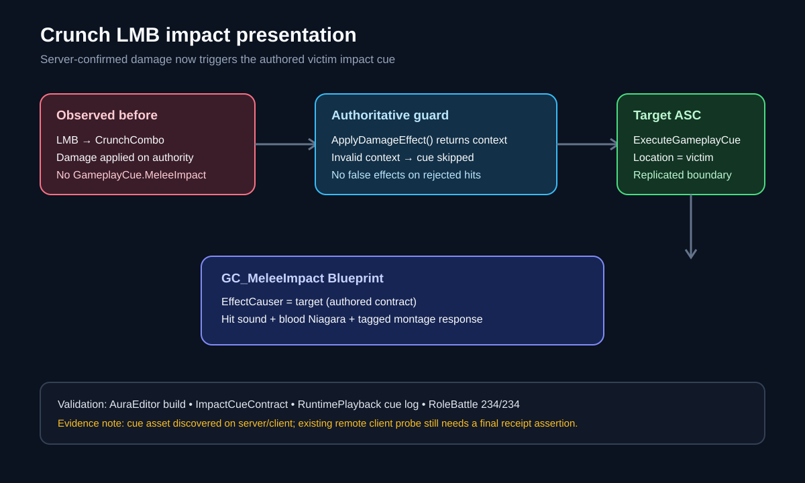

# Restore Crunch LMB impact presentation

## Intent

Restore visible feedback for Aura's migrated LMB Character/Pawn behavior after logs showed that the ability could activate and apply damage without displaying an impact effect.

## Root cause

The live log resolved `InputTag.LMB` to `Abilities.Melee.CrunchCombo`, not FireBolt. `UAuraMeleeAttack::ApplyComboDamage()` applied the authoritative damage effect but never emitted the existing `GameplayCue.MeleeImpact`, so the authored hit sound, Niagara, and target blood presentation had no runtime trigger. FireBolt remains a separate data-driven ability and is not Aura's current LMB after the Crunch migration.

## Changed behavior

- Registered `GameplayCue.MeleeImpact` as `FAuraGameplayTags::GameplayCue_MeleeImpact`.
- After `ApplyDamageEffect()` returns a valid context, dispatch the cue through the affected target's ASC so server-authoritative execution can replicate to relevant clients.
- Populate the cue with the target location, `EffectCauser=Target` for the existing `GC_MeleeImpact` Blueprint contract, and attacker `Instigator`/`SourceObject`.
- Skip the cue when the damage boundary rejects the target, preventing effects for friendly, dead, invalid, or out-of-range targets.
- Added a focused contract assertion for cue dispatch, accepted-damage gating, target location, and the authored victim `EffectCauser` convention.

## Validation

- `AuraEditor Win64 Development` build passed.
- `Aura.Migration.CrunchCombo.ImpactCueContract` passed.
- `Aura.Migration.CrunchCombo.RuntimePlayback` passed; the runtime log contains `[CrunchCombo] Broadcast gameplay cue tag=GameplayCue.MeleeImpact`.
- `Aura.RoleBattle` passed 234/234 tests with zero failures.
- Correct-toolchain listen probe: server activation and four-section authority matrix passed; both server and client logs resolved `GC_MeleeImpact` from the configured GameplayCue path. The existing client probe timed out after its ability instance was released before its final bookkeeping line, so a complete remote receipt assertion remains open.
- Independent in-app ChatGPT review found no blocking code or replication issue and recommended retaining the authority-driven target ASC dispatch; it specifically called out the unusual `EffectCauser=Target` contract and packaged/multiplayer evidence limits.
- Normal-flow visual check: the freshly cooked `Game-RoleConfig-ImpactFix` package and current DebugGame runtime reached the combat HUD; the captured frame showed the migrated LMB `Crunch` slot beside FireBlast, Arcane, and Electrocute. Windows Firewall displayed an OS security prompt before safe automated input could continue, so no automated hit-frame screenshot was claimed. The packaged log still resolved `GameplayCue.MeleeImpact` through `GC_MeleeImpact_C`; the 48 D3D12 PSO errors matched the prior package and are pre-existing startup noise.
- `git diff --check` passed.

