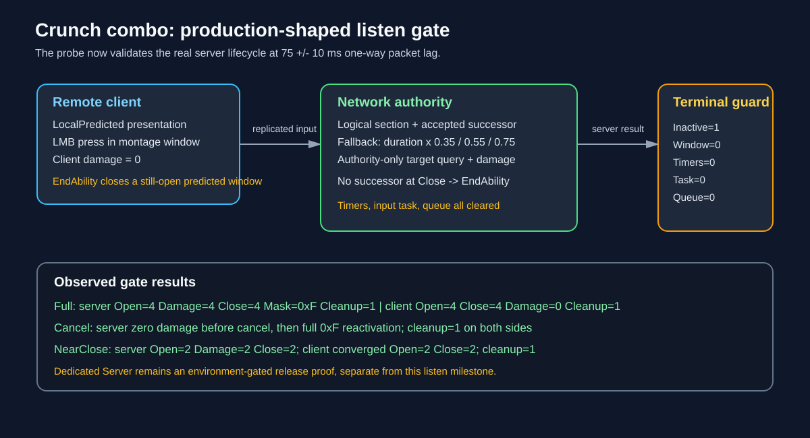

# Crunch combo production-shaped listen runtime gate

## Intent

Close the final network evidence gap for the Crunch Character/Pawn behavior before enabling Aura's role configuration.

## Changed behavior

- Removed the development probe's server mesh pose/tick override and manual queued-notify dispatch, so the listen test exercises the same animation lifecycle used by the role path.
- The non-standalone authority fallback derives Open, Damage, and Close from each montage section duration. A close with no accepted successor is now the terminal authoritative input boundary and ends the ability, clearing fallback timers and input tasks.
- Predicted clients treat an authority end while their local window is still open as an implicit close for convergence bookkeeping. Development diagnostics report window, timer, input-task, queue, and cleanup state.

## Validation

- AuraEditor Win64 Development build passed after the lifecycle changes.
- `RunCrunchComboNetworkSmoke.ps1` passed Full, Cancel, and NearClose at 75 ms one-way packet lag with 10 ms variance.
- Full: server `Open=4 Damage=4 Close=4 Accepted=4 Mask=0xF AuthorityDamage=1 Cleanup=1`; client `Open=4 Damage=0 Close=4 Accepted=0 Mask=0x0 Presses=3 Cleanup=1`.
- Cancel: server observed `Open=1 Damage=0 Close=1 ... WindowOpen=0 FallbackActive=0 FallbackTimers=0 InputTask=0 Queued=0 Cleanup=1`, then reactivated to the full `0xF` matrix; client also reactivated with `Cleanup=1`.
- NearClose: server rejected at `Open=2 Damage=2 Close=2 Mask=0x3 ... Cleanup=1`; client converged to `Open=2 Close=2 ... Cleanup=1`.
- No fatal/crash signatures were reported. Owned processes were torn down by the bounded runner.

## Deferred release gate

Dedicated-server build, cook, and headless proof remain unavailable because the installed UE 5.5 distribution reports that Server targets are unsupported. This is kept separate from the supported listen-server/Game milestone.

