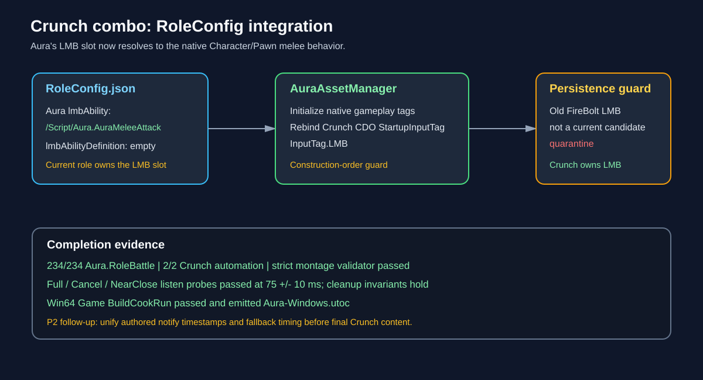

# Crunch combo RoleConfig integration

## Intent

Make the migrated Character/Pawn melee behavior the Aura role's authoritative LMB ability after the listen-server lifecycle gate passed.

## Changed behavior

- `Content/Config/RoleConfig.json` now maps Aura's `lmbAbility` to `/Script/Aura.AuraMeleeAttack` and clears the old XML definition path.
- `AuraAssetManager` rebinds the native Crunch CDO's startup input tag after native gameplay tags initialize, preventing construction-order loss of `InputTag.LMB`.
- Role/Battle contracts now require the native Aura melee producer and quarantine the old saved FireBolt LMB grant when it is not a current role candidate.
- The native combo remains server-authoritative for section progression, target filtering, and damage; the generated RuntimeV2 montage is a validated protocol fixture for this migration slice.

## Validation

- AuraEditor Win64 Development build passed.
- `Aura.RoleBattle` passed all 234 discovered tests.
- `Aura.Migration.CrunchCombo` passed both `NativeContract` and `RuntimePlayback` tests.
- `AuraValidateComboMontage` passed: native class loaded, Aura skeleton, 4 sections, 12 notifies, 0 embedded notifies, and strict timing.
- Win64 Game `BuildCookRun` passed build/cook/stage/package and produced `Aura-Windows.utoc` in `Saved/CookProof/Game-RoleConfig-Final`.
- The final independent in-app ChatGPT review found no demonstrated P0/P1 code defect and approved the supported Win64 Game/listen-server RoleConfig milestone. It retained P2 debt to unify authored notify timestamps with the fallback fractions before final Crunch combat content replaces RuntimeV2, plus the separate dedicated-server environment limitation.

## Deferred release gate

The installed UE 5.5 distribution cannot build/cook a Server target, so dedicated-server/headless proof remains explicitly blocked without changing the supported Game/listen-server decision.

