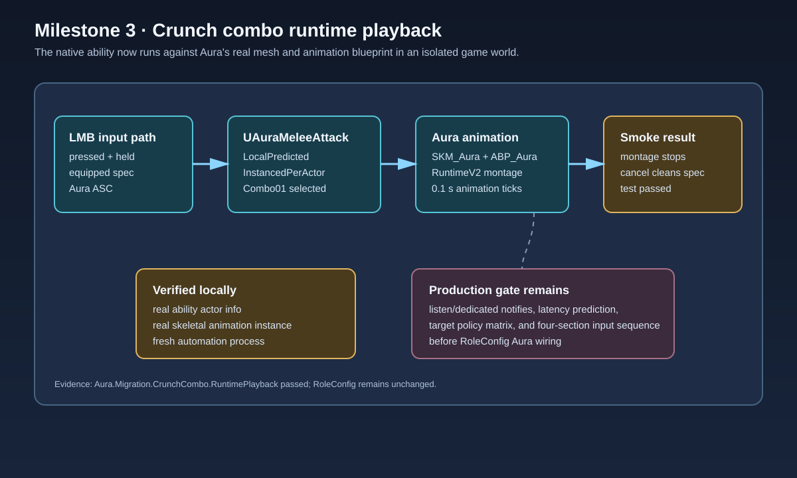

# Crunch combo runtime playback

## Intent

Advance the migration from an asset-only contract to a real Aura runtime smoke test without changing the shipped role loadout. The test exercises the native ability through the same LMB input path used by the player controller.

## Changed behavior

- Added `Aura.Migration.CrunchCombo.RuntimePlayback` under development automation tests.
- The test creates an isolated game world, attaches the Aura mesh and `ABP_Aura`, initializes an Aura ability actor info, grants `UAuraMeleeAttack` to an equipped LMB spec, and drives `AbilityInputTagPressed` plus `AbilityInputTagHeld`.
- The test verifies that the generated montage is playing in `Combo01`, advances the isolated animation tick, observes montage shutdown after the first section with no follow-up input, and confirms cancellation releases the spec.
- The runtime test is deliberately fixture-only. It does not mutate `Content/Config/RoleConfig.json` or make the combo part of the production Aura loadout.

## Validation

- `Build.bat AuraEditor Win64 Development C:\Git\AuraProj\Aura.uproject -waitmutex` passed.
- `UnrealEditor-Cmd.exe Aura.uproject -ExecCmds="Automation RunTests Aura.Migration.CrunchCombo.RuntimePlayback; Quit" ...` passed.
- The runtime log recorded `WorldTime=4.000`, `MontagePlaying=0`, `Section=None`, and `Length=2.333` after the isolated playback loop.
- Existing generated fixture validation and the native CDO contract test remain passing.

## Deferred production gate

Listen and dedicated-server coverage still must prove gameplay-notify delivery, remote prediction/section convergence under latency, cancellation/reactivation reset across every section, and Aura hostile/friendly/self/dead target policy. Role wiring stays deferred until those gates pass.

