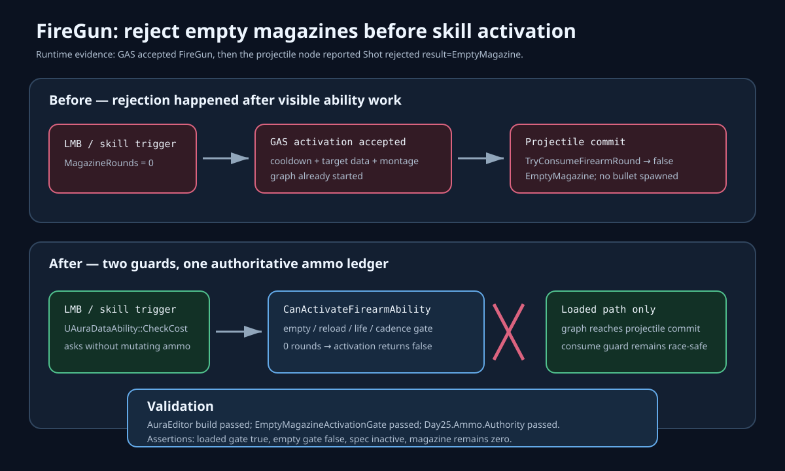

# FireGun empty-magazine activation gate

## Intent

Prevent FireGun from starting when its player-owned firearm ledger has no magazine rounds. Empty-ammo input must not activate the skill, apply cooldown, enter target-data/montage work, or reach the graph merely to fail later.

## Changed behavior

- Before: GAS accepted `FireGun` and started the ability graph. The projectile commit boundary then called `TryConsumeFirearmRound`, received `EmptyMagazine`, destroyed the deferred projectile, and canceled the already-started ability.
- After: `UAuraDataAbility::CheckCost` detects firearm definitions and calls the non-mutating `CanActivateFirearmAbility` contract before activation. Zero rounds now return false immediately.
- The original authority-only `TryConsumeFirearmRound` guard remains at projectile commit, so a race or stale predicted client state still cannot create a free shot.
- The PlayerState ledger owns the shared checks for role applicability, life state, reload state, magazine count, and cadence. Only the consume method mutates rounds and revision.

## Validation

- `AuraEditor Win64 Development` built successfully after the interface, ability gate, PlayerState, and automation changes.
- `Aura.Abilities.FireGun.EmptyMagazineActivationGate` passed. It proves a loaded magazine passes, a restored empty magazine reports `EmptyMagazine`, the GAS cost gate rejects it, the spec remains inactive, and magazine rounds remain zero.
- `Aura.RoleBattle.Day25.Ammo.Authority` passed with the new pre-activation and existing projectile-commit authority contracts.
- `git diff --check` passed with line-ending conversion notices only.
- Independent in-app ChatGPT review is pending the browser's required action-time approval to transmit the focused private-code summary.

## Evidence

- Pre-fix runtime log: `Saved/Logs/GameServerManager/RoleBattleCivilianTest.log` repeatedly records `Activated ... AuraDataAbility`, followed by `[Firearm][Server] Shot rejected ability=FireGun result=EmptyMagazine` and a canceled ability.
- Focused regression log: `Saved/Logs/FireGunEmptyMagazineValidation.log` records `Result={Success}` and exit code 0.
- Authority contract log: `Saved/Logs/Day25AmmoAuthority.log` records `Result={Success}` and exit code 0.
