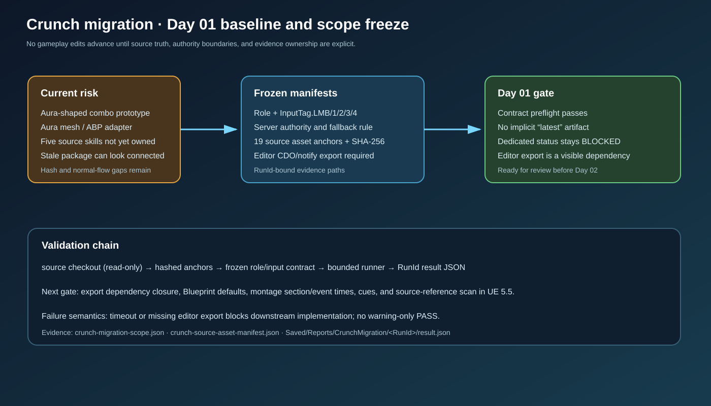

# Crunch migration Day 01 baseline

## Intent

Start the completion plan by freezing the source/target scope, five-input contract, source asset anchor hashes, and bounded runner result format before further gameplay edits.

## Changed behavior

- Added a machine-readable scope manifest for the Crunch role and its five planned skill inputs.
- Added a source asset anchor manifest with SHA-256 baselines and explicit editor-export requirements.
- Added runner contract tests and `RunCrunchMigration.ps1` preflight stages with explicit RunId output and no implicit “latest” artifact selection.

## Validation

- `python Scripts/Tests/test_crunch_migration_runner.py` passed.
- `RunCrunchMigration.ps1 -Stage Fast -Scenario Baseline -RunId crunch-d01-baseline` passed.
- JSON parsing, PowerShell syntax, SVG/XML archive checks, and `git diff --check` passed.

## Gate status

The Day 01 contract preflight is complete. The source manifest remains explicitly pending the UE editor dependency/CDO export; gameplay implementation must not treat the hash inventory alone as final asset truth.

