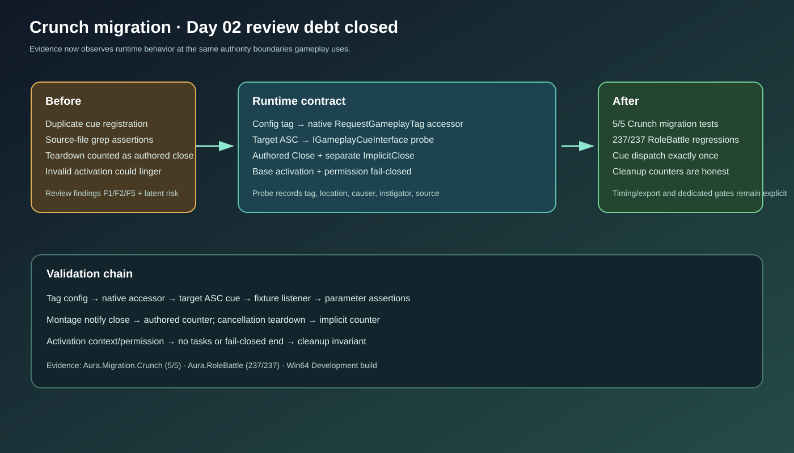

# Crunch migration Day 02 review remediation

## Intent

Close the known Crunch combo review debt before timing or imported-content work advances: one cue registration owner, behavioral cue evidence, honest close-event accounting, and fail-closed ability activation.

## Changed behavior

- `GameplayCue.MeleeImpact` remains config-owned; the native accessor now resolves it with `RequestGameplayTag` instead of registering a duplicate native tag.
- `AAuraRoleApplicationTestActor` implements a runtime gameplay-cue probe so automation observes the target ASC dispatch and verifies tag, target location, effect causer, instigator, source object, and exactly-once delivery.
- `UAuraMeleeAttack` separates authored montage close notifications from implicit teardown closure and calls the base activation contract before permission-gated setup.
- Activation with missing actor/ASC context returns without creating tasks or entering an invalid end-ability path; activation without authority or a prediction key ends fail-closed.
- Cross-process combo probe logs expose `ImplicitClose` separately from authored `Close`.

## Validation

- `AuraEditor Win64 Development` build passed.
- `Automation RunTests Aura.Migration.Crunch` passed 5/5: `ActivationPermissionFailureCleansUp`, `ImpactCueDispatchBehavior`, `TagRegistration`, `Aura.Migration.CrunchCombo.NativeContract`, and `Aura.Migration.CrunchCombo.RuntimePlayback`.
- `Automation RunTests Aura.RoleBattle` passed 237/237.
- `python Scripts/Tests/test_crunch_migration_runner.py` and `RunCrunchMigration.ps1 -Stage Fast -Scenario ReviewRemediation -RunId crunch-d02-review` passed.
- PowerShell syntax, JSON/SVG checks, and `git diff --check` passed.

## Gate status

Day 02 review debt F1, F2, and F5 is remediated with executable coverage. The authored timing/export dependency and dedicated-server capability remain intentionally open for later plan days.

