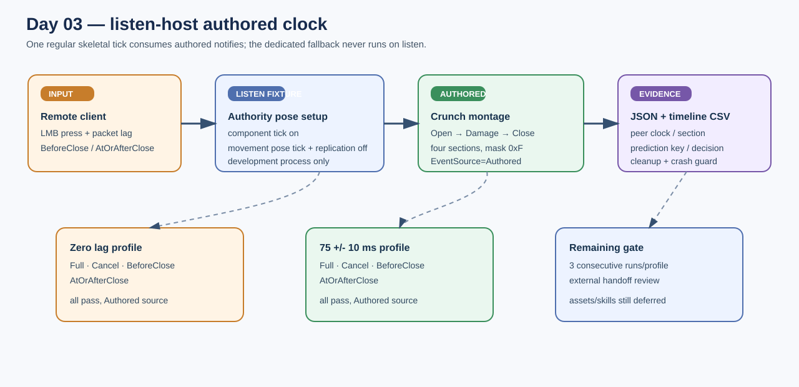

# Crunch migration Day 03 listen authored clock

## Intent

Finish the non-shipping listen-host probe so the authority consumes the real authored Crunch montage events under the same network scenarios used by the remote client.

## Changed behavior

- Dedicated-server fallback remains restricted to `NM_DedicatedServer`; listen reports `EventSource=Authored` and `FallbackActive=0`.
- The isolated listen fixture enables the skeletal component's authored-notify clock, disables the movement-owned pose tick, and suppresses movement replication only for the test process to avoid double advancement.
- `BeforeClose`, `AtOrAfterClose`, `Full`, and `Cancel` are explicit runner scenarios. The probe records authored open/close times, section, prediction key, and input decisions in a per-run timeline CSV.
- No gameplay event is synthesized or manually dispatched.

## Validation

- `AuraEditor` Win64 Development build passed after timing telemetry was added.
- Listen smoke passed for all four scenarios at zero lag and at 75 +/- 10 ms emulated lag, three consecutive runs per scenario/profile (24/24); every run reported `EventSource=Authored`.
- `BeforeClose` authority matrix: `Open=4 Damage=4 Close=4 Accepted=4 Mask=0xF`; client matrix: `Open=4 Close=4 Presses=3 Cleanup=1`.
- `AtOrAfterClose` authority path rejected the late input and the client converged on the same terminal section.
- Crunch migration automation: 5/5; full `Aura.RoleBattle`: 237/237; Python runner and PowerShell syntax contracts passed; `git diff --check` passed.

## Gate status

The bounded Day 03 implementation and three-consecutive-runs-per-profile local gate are complete. The independent handoff review remains open until the action-time browser confirmation is supplied; imported Crunch assets and later skill days remain deferred.

