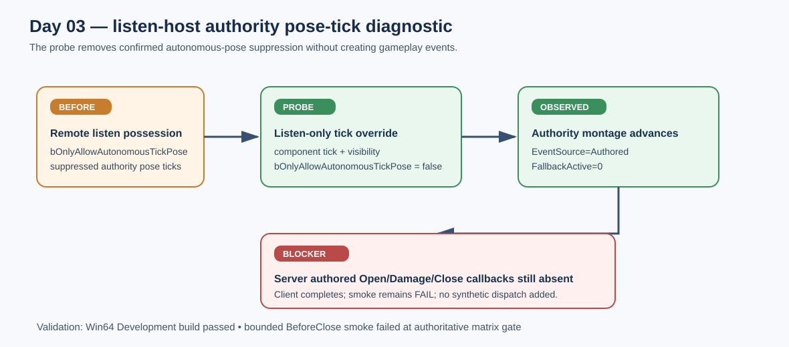

# Crunch migration Day 03 listen-host tick diagnostic

## Intent

Remove the authority-side pose-tick suppression from the non-shipping listen probe so a remotely possessed host character can evaluate authored montage timing locally.

## Changed behavior

- The listen probe now clears `bOnlyAllowAutonomousTickPose` in addition to enabling component ticking and visibility.
- This change is limited to the development probe on `NM_ListenServer`; the shipping path and dedicated-server fallback policy are unchanged.
- No gameplay event is synthesized or manually dispatched.

## Validation

- AuraEditor Win64 Development build passed after the tick-path change.
- A bounded `BeforeClose` listen smoke reached `RemoteActivationObserved=1 EventSource=Authored FallbackActive=0` and the client presentation/input path, while the authoritative server still produced no authored Open/Damage/Close callbacks before the terminal window. The smoke therefore remains a failure and Day 03 remains open.
- Server trace evidence showed the authority montage can advance locally after the probe change; the missing callback path is still unresolved.

## Gate status

Day 03 is not complete. The change removes one confirmed pose-tick precondition, but the listen-host authored-notify matrix and three-consecutive-run timing gate still require a real callback path.

