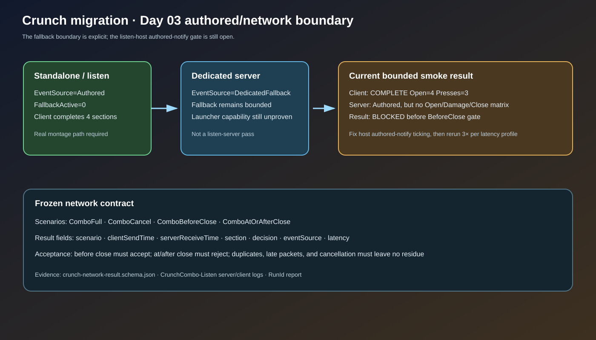

# Crunch migration Day 03 network boundary scaffolding

## Intent

Make the authored-versus-fallback boundary and deterministic network scenario vocabulary executable before relying on listen-host timing evidence.

## Changed behavior

- `UAuraMeleeAttack` selects the development timeline fallback only for `NM_DedicatedServer`; listen and standalone activations report `EventSource=Authored`.
- Development observability now exposes an enum-like event-source name and separates authored and implicit close counts in network logs.
- The listen smoke runner uses a real `?listen` game host, requires a role-qualified startup URL, recognizes `BeforeClose` and `AtOrAfterClose`, and emits a schema-shaped result with scenario, latency, event source, and pass/failure fields.
- A machine-readable network result schema freezes the four scenario names and the two permitted event sources.

## Validation

- AuraEditor Win64 Development build passed after the boundary changes.
- `python Scripts/Tests/test_crunch_migration_runner.py` passed.
- `RunCrunchMigration.ps1 -Stage Fast -Scenario ComboAtOrAfterClose -RunId crunch-d03-after-contract` passed.
- PowerShell syntax and JSON/SVG checks passed.
- Bounded `RunCrunchComboNetworkSmoke.ps1 -Scenario BeforeClose` reached client `COMPLETE Open=4 ... Presses=3` and server `EventSource=Authored FallbackActive=0`, but failed the authoritative four-section server matrix because the headless listen host emitted no server authored Open/Damage/Close events before timeout. This is an explicit Day 03 blocker, not a passing runtime gate.

## Gate status

Day 03 remains in progress. The production fallback boundary is narrowed and observable; the listen server still needs a real authored-notify tick path before timing/network completion can pass.

