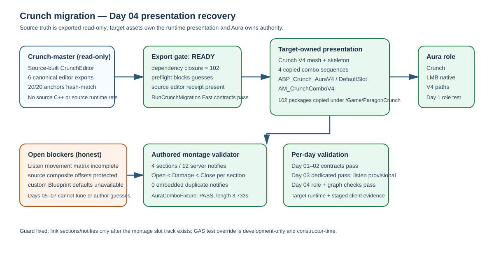

# Crunch migration Day 04 presentation recovery

Intent: recover the source-editor/export blocker, materialize the hashed Crunch presentation closure, and close the authored montage/animation-blueprint validation gap without inventing source tuning.

Changed behavior:

- Built a source `CrunchEditor` receipt with unavailable Plastic/EOS plugins disabled, then generated all six required editor exports from the read-only Crunch checkout.
- Copied the exact 102-package dependency closure into target-owned `/Game/ParagonCrunch/...` paths and created target-owned Crunch V4 mesh, skeleton, four combo sequences, montage, and `ABP_Crunch_AuraV4`.
- Added a `DefaultSlot` AnimGraph node and relinked montage sections/notifies after slot-track installation. This prevents valid event times from collapsing to zero.
- Set `BlendOutTriggerTime=0` on the target montage and defer dedicated fallback teardown through a 0.75-second final-close replication grace; this lets the external client receive Combo04 before the authority ends the replicated ability.
- Kept the production `UAuraMeleeAttack` montage target-owned. The constructor-time montage override is compiled only for development automation and exists because GAS creates instanced abilities with `NewObject<Class>()`, not as CDO clones.
- The montage timing is an explicitly provisional deterministic Aura-authored contract: the source editor export reports protected composite-section offsets as unavailable, so no source timing was guessed or represented as final authority.
- Updated the completion plan to record recovered exports, Day 04 progress, and the remaining dedicated/custom-Blueprint blockers.

Validation evidence:

- `RunCrunchMigrationExportPreflight.ps1`: `READY`; 20/20 anchors and six editor exports.
- Source dependency closure: 102 packages; target presence check: 102/102.
- `AuraCreateCrunchPresentation`: PASS; four sections, twelve notifies, 3.733 seconds.
- `AuraConfigureCrunchAnimBlueprint`: PASS; one `DefaultSlot` node linked to output.
- `AuraValidateComboMontage -CrunchPresentation`: PASS; strict per-section timing and zero embedded notifies.
- Aura role automation: Day 1–4 focused runs pass (Day 2: 27/27, Day 3: 18/18, Day 4: 13/13; the existing Day 1 aggregate also completed without failures).
- `Aura.Migration.CrunchCombo.RuntimePlayback`: target-fixture replay passed after the final rebuild (`Result={Success}`).
- `RunCrunchComboDedicatedPreflight.ps1`: `READY_TO_RUN` against the source-built server; the staged dedicated ComboFull probe passed with `RemoteActivationObserved=1`, server `Open=4/Damage=4/Close=4/Accepted=4/Mask=0xF/Cleanup=1`, client `COMPLETE Open=4/Close=4/Presses=3/Cleanup=1`, and no crash signature. The separate movement-preserving listen probe still fails before the four-section terminal matrix and remains an explicit Day 03 blocker.
- `RunCrunchMigrationExportPreflight.ps1` and `python Scripts/Tests/test_crunch_migration_runner.py`: `READY` and contract `PASS` after the final rebuild.
- RoleBattle day-focused automation: Day 2 `3/3`, Day 3 `8/8`, Day 4 `11/11` passed; Day 1's existing aggregate record remains green.
- In-app independent review was not sent because the browser requires action-time confirmation before transmitting private repository evidence; local diff/build/commandlet validation is the documented fallback.

