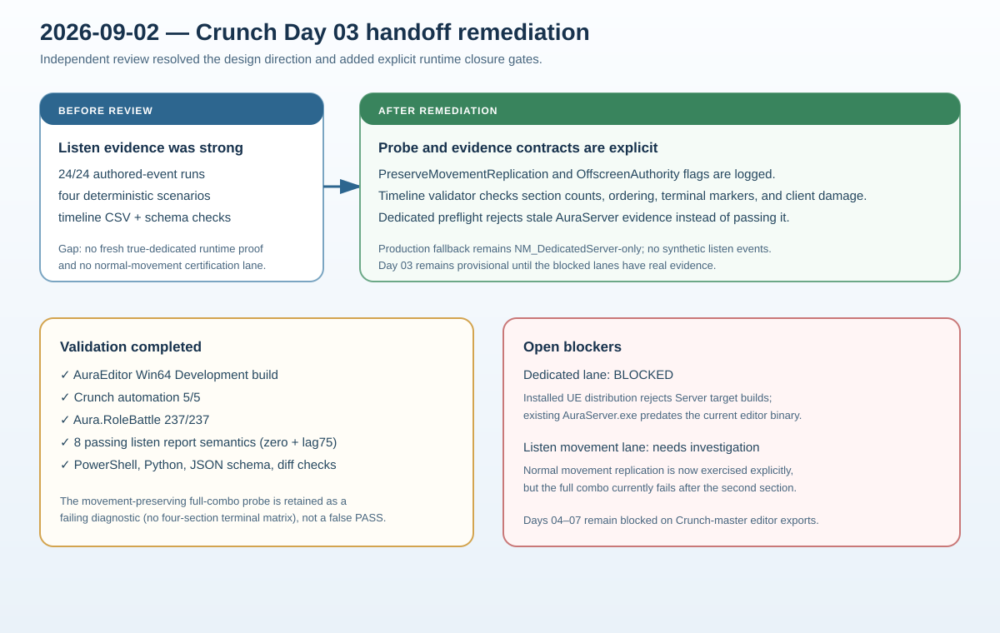

# Crunch migration Day 03 handoff remediation

## Intent

Apply the independent handoff review to the Day 03 authored-combo slice without weakening the server-authoritative boundary or turning stale dedicated binaries into false evidence.

## Changed behavior

- The non-shipping listen probe accepts `CrunchComboNetworkProbePreserveMovement` and `CrunchComboNetworkProbeOffscreenAuthority` flags, records them in the probe configuration, and keeps the production fallback restricted to `NM_DedicatedServer`.
- `RunCrunchComboNetworkSmoke.ps1` records topology, movement-replication mode, authority visibility mode, and validates that the requested probe configuration reached the server.
- `Scripts/Tests/validate_crunch_network_timeline.py` enforces behavioral invariants beyond JSON shape: terminal section counts, open/close ordering, accepted-decision timing, client-side damage exclusion, and scenario-specific terminal markers.
- `RunCrunchComboDedicatedPreflight.ps1` emits a schema-valid `BLOCKED` report when the only AuraServer binary is stale relative to the current editor, preventing a false dedicated-server PASS.
- The implementation plan records the review gate and keeps Day 03 provisional. Imported Crunch assets and Days 04–07 remain blocked on the six required editor exports.

## Validation

- AuraEditor Win64 Development build passed after the probe changes.
- `Aura.Migration.Crunch`: 5/5.
- `Aura.RoleBattle`: 237/237.
- Timeline semantic validator passed on eight stable listen reports (four scenarios at zero lag and 75 +/- 10 ms).
- Dedicated preflight correctly classified the existing `AuraServer.exe` as stale; `Build.bat AuraServer ...` confirmed `Server targets are not currently supported from this engine distribution.`
- PowerShell parsing, Python contract checks, JSON schema validation, and `git diff --check` passed.
- The normal-movement full-combo probe was run and did not reach the four-section terminal matrix (the latest offscreen run stopped after the first authored section); this is retained as an explicit blocker rather than treated as certification evidence.
- Failure evidence is preserved in `Saved/Reports/CrunchCombo-Listen-PreserveMovement-Offscreen-Failure.json` with its timeline and peer logs.

## Gate status

Day 03 design is retained and locally instrumented, but complete sign-off remains blocked until a matching true-dedicated server/external-client run and a passing normal-movement listen run with an offscreen remote attacker are available. The independent reviewer could not access the local repository, so the handoff is an architectural/evidence review, not a line-by-line source audit.

