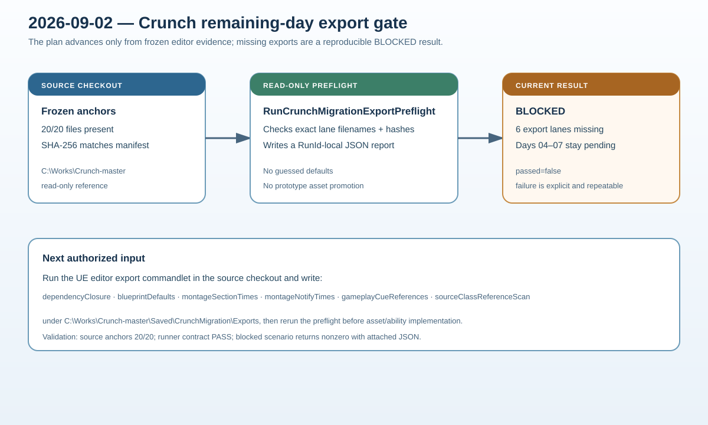

# Crunch migration remaining-day export gate

## Intent

Continue the remaining Crunch migration days without fabricating source tuning or advancing prototype assets when the required editor exports are unavailable.

## Changed behavior

- Added `RunCrunchMigrationExportPreflight.ps1` to hash-check all 20 frozen Crunch anchors and report each required editor export lane.
- Updated `RunCrunchMigration.ps1` so Days 04–10 asset/ability scenarios invoke the preflight and fail closed with a RunId-local artifact when exports are missing.
- Recorded the reproducible Days 04–07 blocker and the exact next input in the implementation plan.

## Validation

- Source anchor verification: 20/20 hashes match the frozen manifest.
- Export preflight: `status=BLOCKED`, `passed=false`; all six required lanes are explicitly listed as missing.
- `RunCrunchMigration.ps1 -Stage Fast -Scenario Assets -RunId crunch-d04-export-gate-2`: nonzero with `source-export-preflight.json` attached.
- `python Scripts/Tests/test_crunch_migration_runner.py`: PASS.
- PowerShell parser, JSON inspection, SVG XML, and `git diff --check` are required before completion.

## Gate status

Days 04–07 remain pending until the read-only UE editor export commandlet writes the six canonical JSON files under `C:\Works\Crunch-master\Saved\CrunchMigration\Exports`. Days 08–10 remain downstream pending; no shutdown is issued while this dependency is unresolved.

