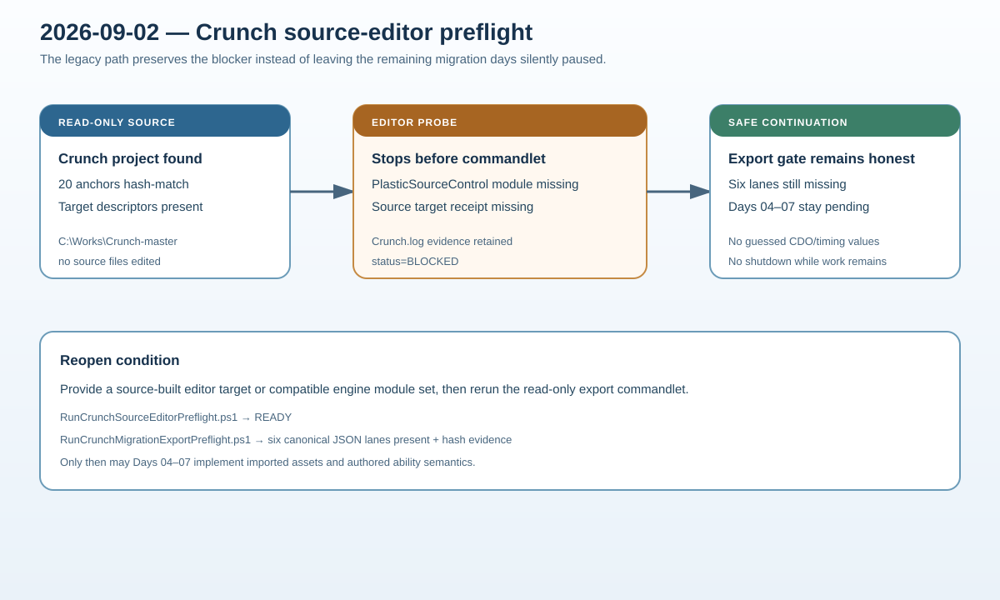

# Crunch migration source-editor blocker

## Intent

Continue the remaining Crunch days through the legacy/local path when the source editor cannot start, while preserving the exact environment failure that prevents frozen export generation.

## Changed behavior

- Added `RunCrunchSourceEditorPreflight.ps1` to check the source project, editor executable, target descriptors, and the latest source editor log.
- The preflight records the observed missing `PlasticSourceControl` module and missing source target receipt as `status=BLOCKED` instead of presenting the export gate as an unexplained omission.
- `RunCrunchMigrationExportPreflight.ps1` now includes the source-editor preflight artifact and blocks export generation when that environment cannot run the read-only commandlet.
- The implementation plan records the exact prerequisite for reopening Days 04–07.

## Validation

- Source project and editor executable paths were found.
- `Crunch.log` records the plugin-module failure and target-receipt absence; source target descriptors are present after path correction.
- Source editor preflight emits `status=BLOCKED`, `passed=false`, and a JSON artifact.
- Export preflight still reports all six missing editor lanes and includes `sourceEditorPreflight.exitCode=1`.
- PowerShell parser and `python Scripts/Tests/test_crunch_migration_runner.py` pass.
- The in-app handoff packet was prepared but not transmitted because the browser requires a fresh action-time confirmation; the documented local/legacy fallback review was used instead.

## Gate status

Days 04–07 remain pending until a source-built editor target (or compatible engine installation) can run the read-only export commandlet. No source checkout files were edited, no values were guessed, and no computer shutdown was issued.

