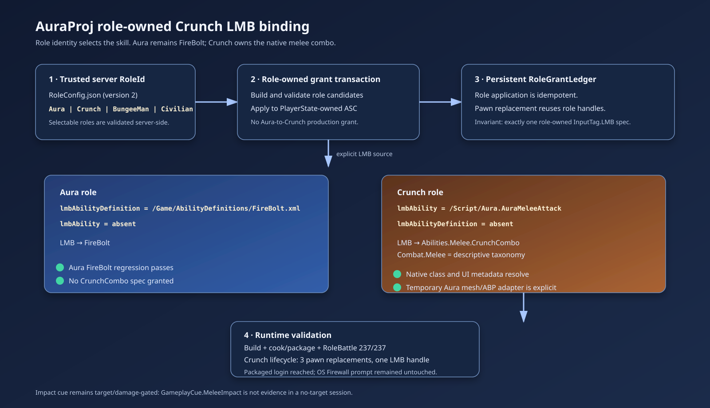

# Crunch role LMB binding

The migration now exposes Crunch as a selectable AuraProj role so the migrated native melee behavior is owned by the role that uses it. Aura keeps its data-driven FireBolt LMB binding, while Crunch uses `/Script/Aura.AuraMeleeAttack` and `Abilities.Melee.CrunchCombo` with mutually exclusive XML/native selectors.

The role grant transaction remains server-authoritative and records concrete role-owned ability handles in the persistent PlayerState ASC ledger. A new lifecycle test reapplies Crunch across three pawn replacements and verifies one Crunch LMB spec, zero Aura FireBolt specs, one ledger handle, and one grant notification. `Combat.Melee` is retained as descriptive taxonomy; it does not select or grant the ability. Crunch's Aura mesh and ABP are an explicit temporary presentation adapter until the final Crunch assets are migrated.

Validation completed:

- AuraEditor/Aura Win64 Development rebuild succeeded.
- `Aura.RoleBattle` passed 237/237, including Crunch catalog, native-LMB ownership, and persistent-ASC lifecycle coverage.
- Win64 Development full cook, stage, pak, and archive succeeded at `Saved/CookProof/Game-RoleConfig-Lifecycle-20260902`.
- Packaged `Aura.log` loaded `RoleConfig` version 2 with four roles and resolved `GameplayCue.MeleeImpact`; it reached `/Game/Maps/Login` and created the login UI.
- Computer Use captured the packaged login window. A Windows Firewall prompt obscured part of the UI and was left untouched because OS security prompts must not be automated.
- Independent in-app handoff review found no blocker and recommended proceeding to packaged validation; its remaining concern was the lifecycle invariant now covered by the new test.

