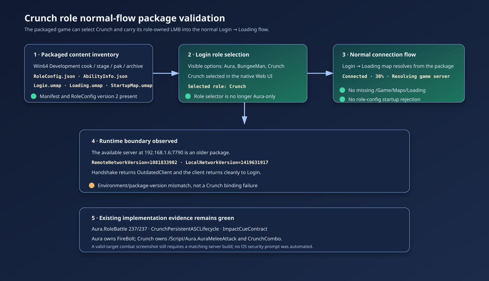

# Crunch role normal-flow package validation

## Intent

Validate the final packaged normal flow after exposing Crunch as a selectable Character role whose LMB skill is owned by the role rather than by Aura.

## Observed behavior

- The Win64 Development cook, stage, pak, and archive completed successfully.
- The packaged manifest contains `RoleConfig.json`, `AbilityInfo.json`, `Login.umap`, `Loading.umap`, and `StartupMap.umap`.
- The clean packaged Login screen exposes Aura, BungeeMan, and Crunch. Selecting Crunch updates the UI to `Selected role: Crunch`.
- Connecting enters the packaged Loading map and reaches `Connected` at 30% while resolving the game server.
- The available server at `192.168.1.6:7790` rejects the client with `OutdatedClient` because it is an older build (`RemoteNetworkVersion=1081833902` vs `LocalNetworkVersion=1419631917`). The client returns to Login without a crash or role-config failure.

## Validation

- `Aura.RoleBattle` passed 237/237, including the persistent PlayerState ASC lifecycle test: three pawn replacements, one Crunch LMB spec, zero FireBolt specs, one ledger handle, and one grant notification.
- The packaged `Aura.log` published RoleConfig version 2 with four roles, loaded the five XML ability definitions, opened the Login Web UI, resolved `/Game/Maps/Loading`, and recorded the explicit Crunch travel URL.
- The `GameplayCue.MeleeImpact` contract and target-ASC dispatch remain covered by the focused native tests; a matching-server valid-target visual hit remains an environment-dependent follow-up.
- `git diff --check`, JSON parsing, and SVG XML parsing passed. Pre-existing D3D12 PSO initialization errors remain startup noise and did not prevent Login or Loading.
- Independent in-app review had already returned **GO** for the role ownership, lifecycle, configuration, packaging, and GameplayCue integration. A second handoff attempt for this final package packet timed out twice, so the final package-specific limitation is recorded from local logs and screenshots rather than attributed to a new external review.

