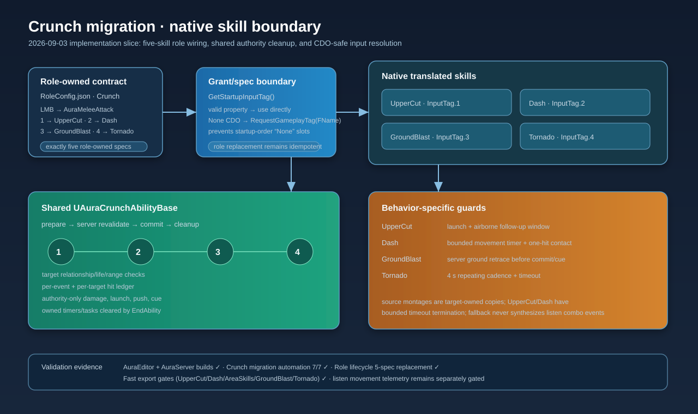

# Crunch ability slice and input resolution — 2026-09-03

## Intent

Continue the Crunch character-behavior migration through the shared native ability boundary and the four non-LMB skills, while making role grants safe when Unreal constructs ability CDOs before native gameplay tags are registered.

## Changed behavior

- Added a shared `UAuraCrunchAbilityBase` authority/cleanup boundary with relationship/life/range revalidation, per-event/per-target dedupe, authority-only damage/launch/push, and owned timer cleanup.
- Added native UpperCut, Dash, GroundBlast, and Tornado abilities, target-owned montage references, Crunch ability/cooldown/cue tags, role startup grants, and AbilityInfo metadata.
- Added `GetStartupInputTag()` and lazy FName-based resolution so CDOs created during early startup do not permanently retain `None` input tags. Role grant, spec slot, and ability-source paths now use the resolver.
- Updated the persistent Crunch role lifecycle test to require all five role-owned specs and exact InputTag.1–4 mappings.
- Updated the damage-producer inventory to classify the shared Crunch boundary as infrastructure rather than an untracked producer.
- Added bounded timeout termination for UpperCut and Dash when an imported montage or start notify is unavailable, so predicted activations cannot remain active indefinitely.
- Corrected the stale native combo contract to point at the target-owned `AM_CrunchComboV4` montage.
- Updated the completion plan with the current Day 05–08 evidence and the explicit Day 09/10 packaged-network gates that remain open.

## Validation

- AuraEditor Win64 Development build: passed.
- `Aura.Migration.Crunch` automation: 7 tests, 5 passed and 2 warning-only engine tests, 0 failures.
- `Aura.RoleBattle.Day6.CrunchPersistentASCLifecycle`: passed with five role-owned handles across three pawn replacements.
- `Scripts/Tests/test_crunch_migration_runner.py`: contract pass.
- Fresh combo listen smoke with movement replication enabled and offscreen authority: pass; `EventSource=Authored`, server/client terminal matrices complete.
- Fast migration preflight: Uppercut, Dash, AreaSkills, GroundBlast, and Tornado passed.
- `git diff --check`: passed.

The packaged normal-flow matrix and per-skill listen/dedicated runtime probes remain separate Day 09 gates; this archive does not claim those gates are complete.

