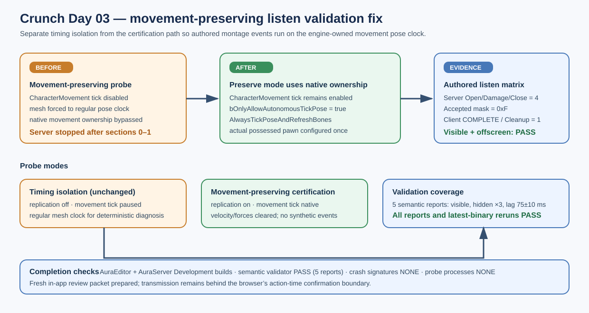

# Crunch movement-preserving listen validation fix

## Intent

Apply the independent-review remedy for the failing movement-preserving listen probe: preserve the real CharacterMovement/network pose path while keeping timing isolation explicit and disposable.

## Changed behavior

- Preserve mode leaves CharacterMovement ticking and keeps `bOnlyAllowAutonomousTickPose` enabled so the engine owns the authoritative montage clock.
- The probe clears incidental velocity/forces instead of disabling movement simulation, and configures the actual possessed pawn rather than a controller-wide one-shot flag.
- Both modes use `AlwaysTickPoseAndRefreshBones`; timing isolation still disables movement replication and uses its regular mesh clock.
- A server-side `MovementState` diagnostic records replication, movement/mesh tick, autonomous-pose, visibility policy, and network roles. No gameplay event is synthesized.

## Validation

- `AuraEditor` and `AuraServer` Win64 Development builds passed after the applied change.
- Visible movement-preserving listen Full passed with authored server `Open=4 Damage=4 Close=4 Accepted=4 Mask=0xF AuthorityDamage=1 Cleanup=1` and client `COMPLETE Open=4 Damage=0 Close=4 ImplicitClose=0 Accepted=0 Mask=0x0 Presses=3 Cleanup=1`.
- Hidden/offscreen movement-preserving listen Full passed three consecutive times, plus a hidden run at 75±10 ms emulated latency; all five saved reports passed `Scripts/Tests/validate_crunch_network_timeline.py`.
- Latest-binary visible and hidden reruns passed; `git diff --check` passed; crash signatures and leftover `UnrealEditor-Cmd` probe processes were absent.

## Handoff status

The scoped independent-review packet is prepared for the signed-in in-app ChatGPT tab. Browser policy requires action-time confirmation immediately before transmitting the private repository summary, so a fresh response is pending that confirmation. Existing review findings were applied locally and the local fallback evidence is complete.

