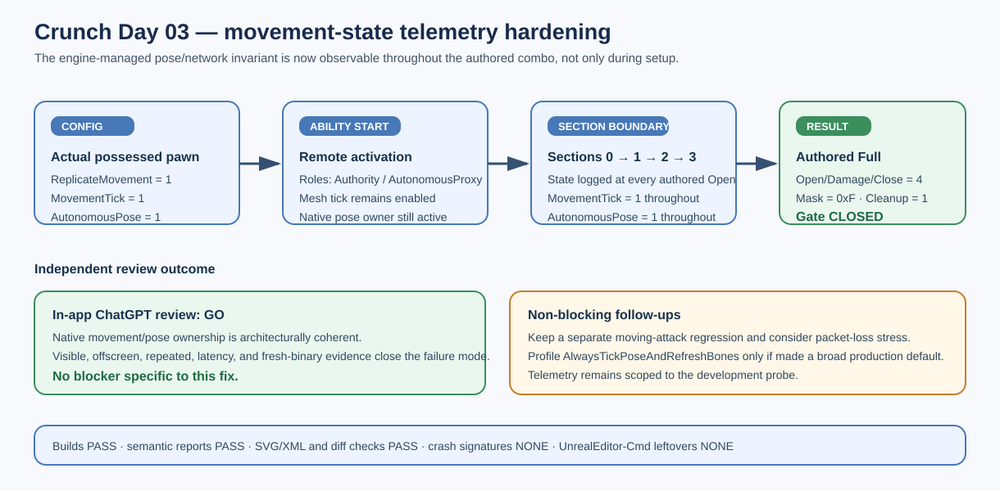

# Crunch movement-state telemetry hardening

## Intent

Apply the independent review's low-severity hardening recommendation so the engine-managed movement and autonomous-pose invariant is observable at configuration, ability start, and every authored combo section boundary.

## Changed behavior

- `MovementState` now logs the phase and section alongside replication, CharacterMovement tick, mesh tick, autonomous-pose, visibility policy, and local/remote roles.
- The diagnostic resets per possessed pawn and per activation, so pawn replacement and later activations cannot inherit stale section state.
- The telemetry is development-only and does not synthesize or replace authored gameplay events.

## Validation

- AuraEditor and AuraServer Win64 Development builds passed.
- Latest-binary visible and offscreen movement-preserving Full listen runs passed with authored four-section server matrices and client cleanup.
- Both latest reports passed `Scripts/Tests/validate_crunch_network_timeline.py`; the full selected evidence set remains green (the retained pre-fix failure artifact is intentionally excluded from pass aggregation).
- Logs show `MovementState` at Config, AbilityStart, and SectionBoundary sections 0, 1, 2, and 3 with `Replicate=1 MovementTick=1 AutonomousPose=1`; no crash signatures or orphan probe processes were found.
- Independent in-app ChatGPT review returned `GO — Movement-preserving listen authored-event gate: PASS / CLOSED`; packet-loss, moving-attack, and performance profiling suggestions are explicitly non-blocking.

