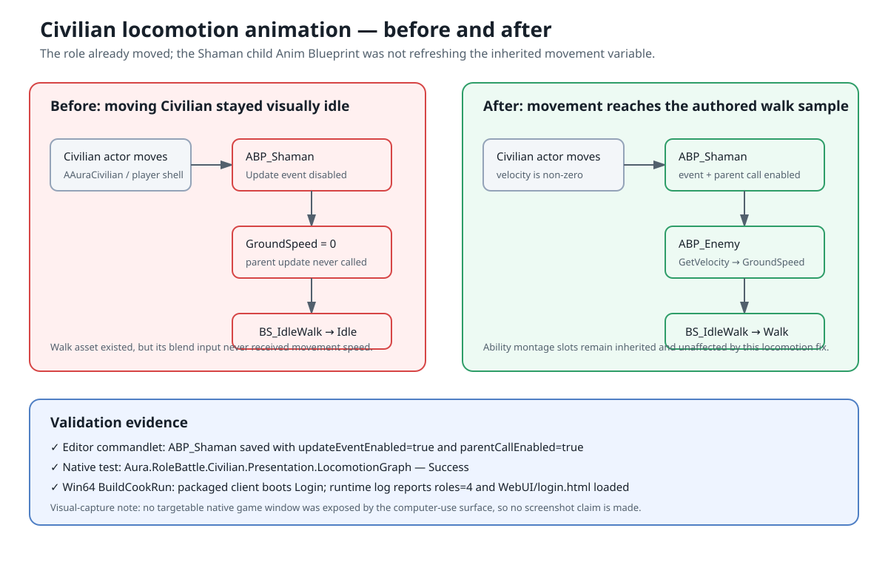

# Civilian locomotion animation fix

Date: 2026-09-05  
Intent: Restore walking animation for the Civilian role while preserving the existing inherited enemy locomotion and montage-slot behavior.

## Changed behavior

The Civilian role uses `ABP_Shaman`, which inherits the `ABP_Enemy` locomotion graph. The child Anim Blueprint contained a `Blueprint Update Animation` event and a parent-update call, but both nodes were disabled. As a result, `GroundSpeed` never updated from movement velocity and `BS_IdleWalk` remained on its idle sample.

The new `AuraConfigureCivilianAnimBlueprint` editor commandlet enables both nodes and saves the authored `.uasset`. A native regression test fails if either node is missing or disabled.

## Validation

- `build_test.bat`: passed.
- `AuraConfigureCivilianAnimBlueprint`: passed; report records both nodes enabled.
- `Aura.RoleBattle.Civilian.Presentation.LocomotionGraph`: passed.
- `test_role_battle_days_7_9.py`: passed.
- `test_civilian_ai.py`: passed.
- `test_scifi_desert_civilian_population.py`: passed.
- Win64 BuildCookRun archive: passed at `Saved/StagedBuilds/CivilianLocomotion-20260905-game`.
- Packaged runtime: reached Login, published four roles, and loaded `WebUI/login.html`.

The available computer-use surface exposed no native game window, so a screenshot-based in-game walk check could not be completed. The native graph assertion and packaged startup evidence are retained as the fallback; this record makes no screenshot claim.

