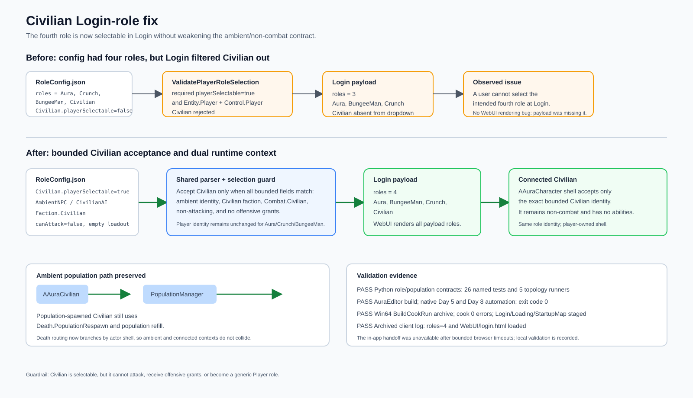

# Civilian Login selectable fix

## Intent

Fix the Login screen regression where the role catalog contained four roles but the Civilian option was absent from the selectable dropdown.

## Changed behavior

- `Civilian.playerSelectable` is now `true` in `Content/Config/RoleConfig.json`.
- The shared role parser and player-selection validator accept Civilian only as a bounded non-attacking role with the exact ambient identity, Civilian faction, `Combat.Civilian`, and no offensive grants.
- The normal `AAuraCharacter` player shell accepts that bounded Civilian identity; the existing `AAuraCivilian` shell remains the population-spawned ambient implementation.
- Authoritative death handling branches by actor shell, preserving population refill for ambient Civilian actors and normal player respawn for a connected Civilian.
- The existing Login WebUI renders the server payload unchanged, so the four validated roles now appear as Aura, BungeeMan, Crunch, and Civilian.

## Validation

- `python Scripts/test_role_battle_days_7_9.py` — PASS: 26 named tests and 5 topology runners.
- `python Scripts/test_civilian_ai.py` — PASS.
- `python Scripts/test_scifi_desert_civilian_population.py` — PASS.
- `build_test.bat` — PASS: AuraEditor Win64 Development.
- Native automation `Aura.RoleBattle.Day5` — PASS, exit code 0; Civilian empty-loadout, explicit four-role catalog, Login validation, and server validation tests succeeded.
- Native automation `Aura.RoleBattle.Day8` — PASS, exit code 0; Civilian identity/ASC, damage guard, loadout, invalid-role, and presentation tests succeeded.
- Win64 `BuildCookRun` archive — PASS, cook completed with 0 errors; the staged manifest contains `RoleConfig.json`, `Login`, `Loading`, and `StartupMap` assets.
- Archived client runtime — PASS; `[RoleConfig][InitGame] Published version=2 roles=4 default=Aura` and `[WebUI] Loaded HTML asset path=WebUI/login.html` were recorded in `Saved/Logs/CivilianSelectablePackageRuntime-20260905.log`.

The in-app Claude handoff was unavailable after the previously completed bounded browser attempts; no private implementation packet was transmitted. Local build, native automation, package, and runtime checks were used as the fallback validation path. Native app visual capture was also unavailable in the current desktop surface, so the runtime log is the available packaged-client evidence.

