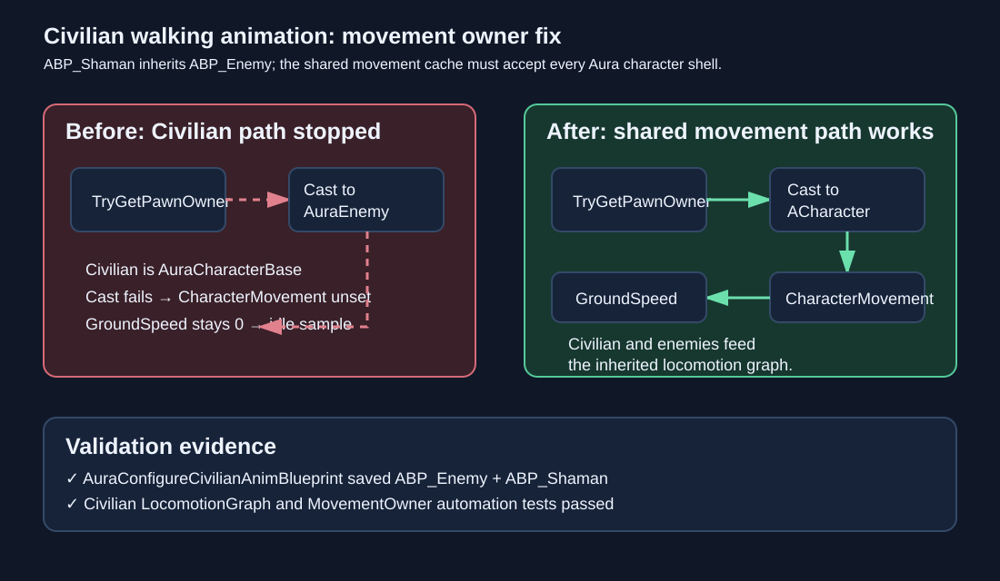

# Civilian movement owner animation fix

Date: 2026-09-05  
Intent: Make the inherited Shaman locomotion graph update speed for Civilian actors while retaining the existing AuraEnemy status path.

## Changed behavior

`ABP_Shaman` calls the `ABP_Enemy` update graph. That graph initialized its cached `CharacterMovement` through an `AuraEnemy` cast, which fails for both the playable `AAuraCharacter` Civilian shell and ambient `AAuraCivilian` shell. The editor commandlet now adds an `ACharacter` cast from `TryGetPawnOwner` and routes the shared `CharacterMovement` getter through it. `GroundSpeed` can therefore drive the inherited idle/walk blend for Civilian movement; the existing `AuraEnemy` cast remains available for enemy-only status variables.

## Validation

- `build_test.bat`: passed.
- `AuraConfigureCivilianAnimBlueprint`: passed; report records `enemyMovementConfigured=true` and both Shaman update nodes enabled.
- `Aura.RoleBattle.Civilian.Presentation.LocomotionGraph`: passed.
- `Aura.RoleBattle.Civilian.Presentation.MovementOwner`: passed against the saved `ABP_Enemy.uasset`.
- `test_role_battle_days_7_9.py`: passed.
- `test_civilian_ai.py`: passed.
- `test_scifi_desert_civilian_population.py`: passed.
- `git diff --check`: passed.
- In-app Claude review was unavailable after two bounded browser timeouts; local Unreal build, commandlet, asset graph assertions, and role regressions are the fallback validation path.

