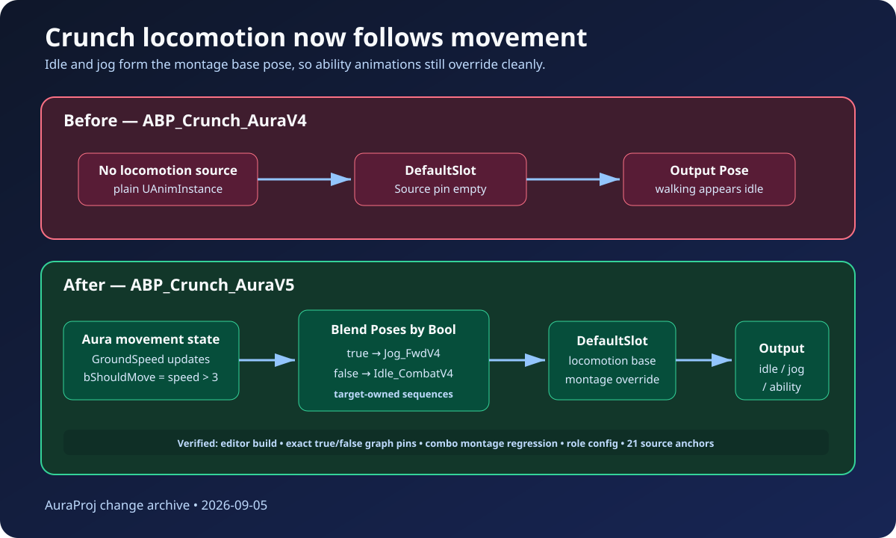

# Crunch locomotion animation fix

## Intent

Restore visible locomotion for the migrated Crunch role. Walking previously left Crunch on the idle/base pose even though character movement was active.

## Root cause

`ABP_Crunch_AuraV4` was generated with a `DefaultSlot -> Output Pose` graph and no source pose feeding the slot. It also inherited directly from `UAnimInstance`, so Aura's existing `GroundSpeed` and `bShouldMove` updates were unavailable to the Crunch animation graph.

## Changed behavior

- Added target-owned Crunch combat-idle and forward-jog animation sequences.
- Added `ABP_Crunch_AuraV5`, parented to `UAuraCharacterAnimInstance`.
- Wired `bShouldMove` to a true/false locomotion selector: true selects `Jog_FwdV4`, false selects `Idle_CombatV4`.
- Fed the selected locomotion pose into `DefaultSlot`, preserving migrated ability montage playback as an override.
- Updated the Crunch role definition and combo runtime fixture to use V5.
- Extended the presentation commandlets and source manifest so the new graph and source animation anchors are reproducible and hash-checked.

## Validation

- `AuraEditor Win64 Development` build passed.
- `Aura.Migration.Crunch.Presentation.LocomotionGraph` passed, including exact moving-to-jog and stopped-to-idle pin assertions.
- `Aura.Migration.CrunchCombo.RuntimePlayback` passed, proving the combo montage still plays through `DefaultSlot`.
- `Aura.RoleBattle.Day1CrunchRoleCatalogAndMetadata` passed with the V5 role path.
- Crunch export preflight passed with 21/21 source anchors and 6/6 editor-export lanes.
- JSON parsing, Python syntax, SVG XML, and `git diff --check` are included in the final hygiene pass.

The in-app ChatGPT review could not be transmitted because the available ChatGPT tab was signed out. No sign-in was attempted; the documented local repository-validation fallback was used instead.

## Illustration

