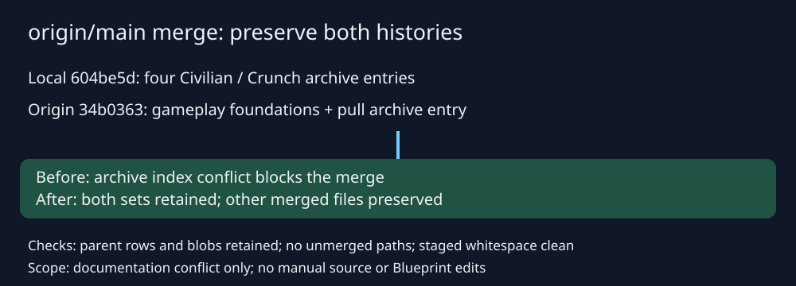

# Complete origin/main archive merge

## Intent and behavior
Finish the existing merge of local `604be5d` and origin/main `34b0363`. Resolve the sole conflict in the archive index by retaining all four local Civilian/Crunch entries and the incoming pull entry. Preserve all other merged files and earlier archive artifacts. No manual source or Blueprint edits.

## Validation
Fresh fetch confirms origin/main matches the pending merge target. Both parent archive histories retained. Merged file blobs checked against both parents. Staged whitespace and unmerged-path checks passed. Runtime tests and external code review were not rerun for this documentation-only conflict resolution.

