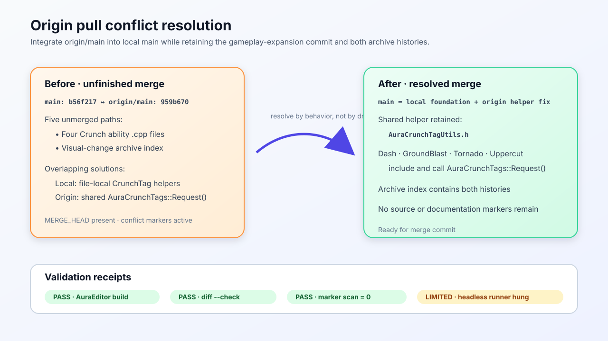

# Origin Pull Conflict Resolution — 2026-09-05

## Intent

Complete the in-progress `origin/main` integration on local `main` and resolve the overlapping Crunch gameplay-tag helper changes without discarding the local gameplay-expansion foundation or either branch's visual-change archive history.

## Changed behavior

- Kept `origin/main`'s shared inline `AuraCrunchTags::Request()` helper in `AuraCrunchTagUtils.h`.
- Updated Dash, GroundBlast, Tornado, and Uppercut to include and use the shared helper, eliminating the conflicting file-local helper definitions while preserving all gameplay tag names and behavior.
- Combined the local archive rows with the incoming Unity-safe helper row in `.claude/memory/visual-change-archive.md`.

## Validation

- `./BuildEditor.command` — PASS; AuraEditor Mac Development built and deployed with the four resolved Crunch translation units compiling successfully. One unrelated existing deprecation warning was emitted from `AuraHUD.cpp`.
- `git diff --cached --check` — PASS.
- Repository conflict-marker scan — PASS; zero `<<<<<<<`, `=======`, or `>>>>>>>` markers remain.
- Focused `Aura.Migration.Crunch` headless automation — environment-limited; the available macOS UnrealEditor process hung before creating its requested log, so the process was terminated without changing project files.

